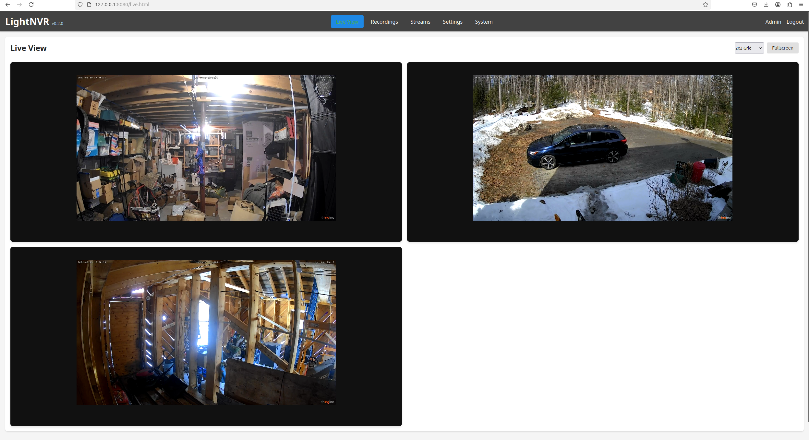
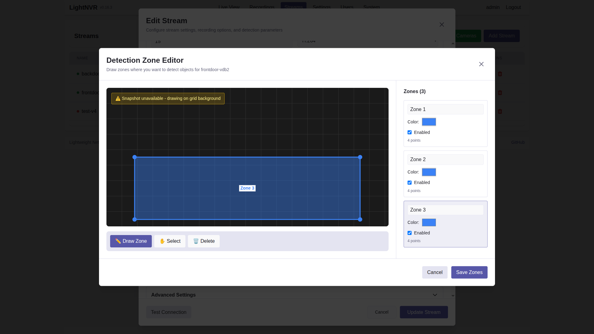
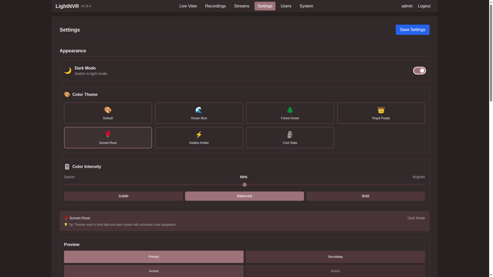
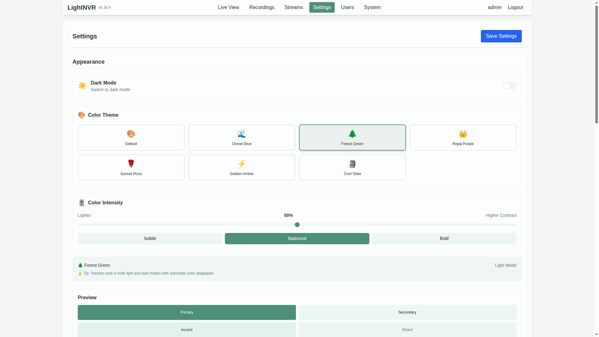
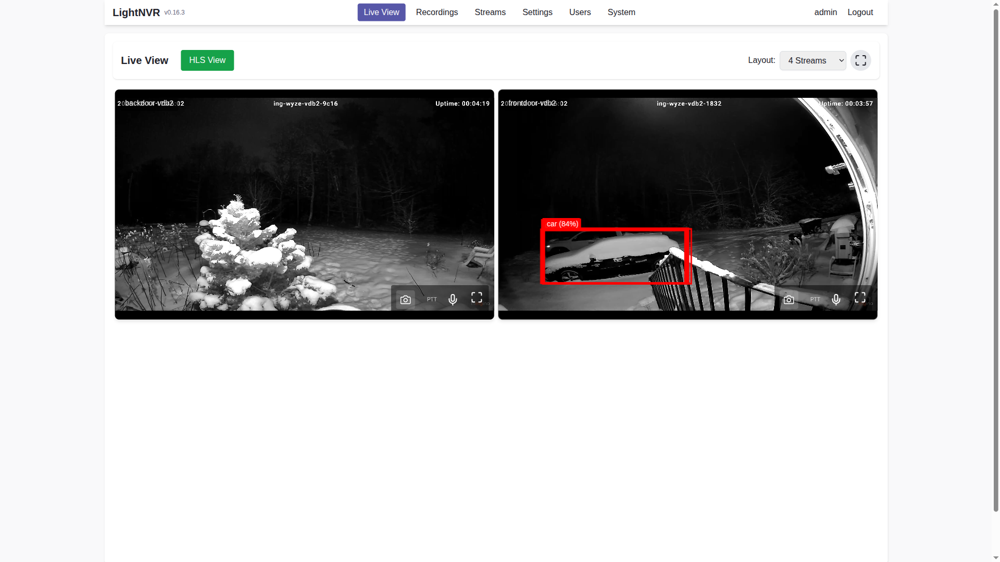
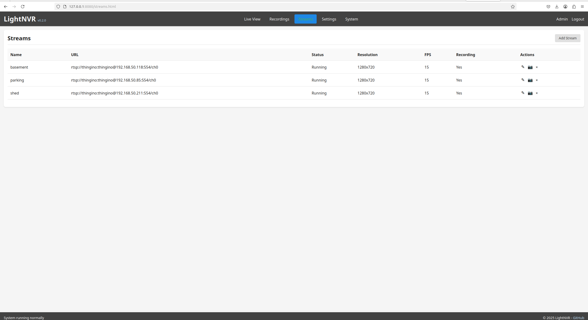
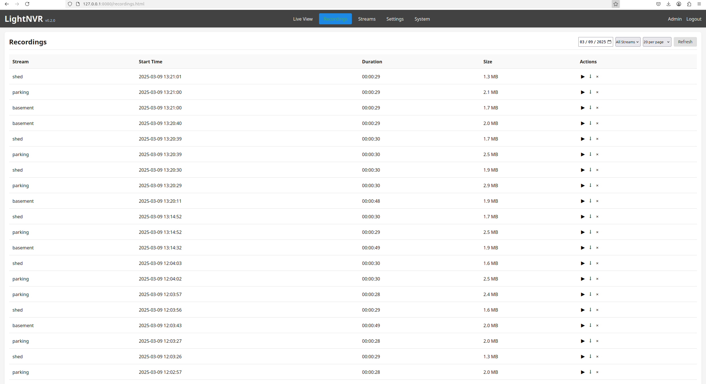
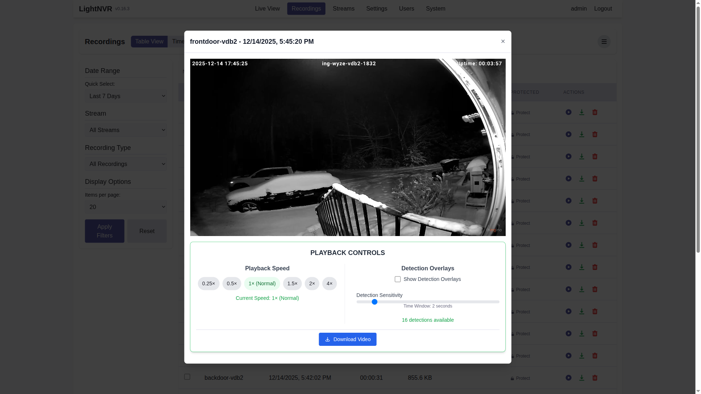
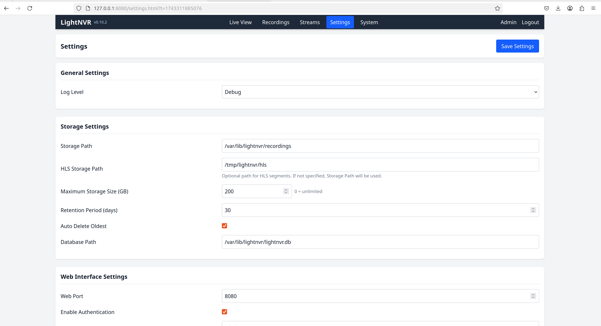

# LightNVR - Lightweight Network Video Recorder

[](https://www.gnu.org/licenses/gpl-3.0)
[](https://hub.docker.com/r/opensensor/lightnvr)

LightNVR is a tiny, memory-optimized Network Video Recorder software written in C. While originally designed for resource-constrained devices like the Ingenic A1 SoC with only 256MB of RAM, it can run on any Linux system.

## Overview

LightNVR provides a lightweight yet powerful solution for recording and managing IP camera streams. It's designed to run efficiently on low-power, memory-constrained devices while still providing essential NVR functionality with a modern, responsive web interface.



> **✨ New Features:** Detection zones with visual polygon editor, customizable themes, enhanced light-object-detect integration, and ultra-low latency WebRTC streaming!

### Key Features

#### 🎯 Smart Detection & Recording
- **Detection Zones**: Visual polygon-based zone editor for targeted object detection - define multiple zones per camera with custom class filters and confidence thresholds
- **light-object-detect Integration**: Seamless integration with [light-object-detect](https://github.com/opensensor/light-object-detect) API for ONNX/TFLite-based object detection with zone filtering
- **ONVIF Motion Recording**: Automated recording triggered by ONVIF motion detection events
- **Object Detection**: Optional SOD integration for motion and object detection (supports both RealNet and CNN models)

#### 📺 Streaming & Playback
- **WebRTC Streaming**: Ultra-low latency live viewing with automatic NAT/firewall traversal via STUN/ICE
- **HLS Streaming**: Adaptive bitrate streaming for broad device compatibility
- **Dual Streaming Modes**: Toggle between WebRTC (low latency) and HLS (compatibility) on-the-fly
- **Detection Overlays**: Real-time bounding boxes and labels on live streams

#### 🎨 Modern User Interface
- **Customizable Themes**: 7 beautiful color themes (Ocean Blue, Forest Green, Royal Purple, Sunset Rose, Golden Amber, Cool Slate, Default)
- **Dark/Light Mode**: Automatic system preference detection with manual override
- **Color Intensity Control**: Fine-tune theme brightness and contrast to your preference
- **Responsive Design**: Built with Tailwind CSS and Preact for smooth, modern UX

#### 🔧 Core Capabilities
- **Cross-Platform**: Runs on any Linux system, from embedded devices to full servers
- **Memory Efficient**: Optimized to run on devices with low memory (SBCs and certain SoCs)
- **Stream Support**: Handle up to 16 video streams (with memory-optimized buffering)
- **Protocol Support**: RTSP and ONVIF (basic profile)
- **Codec Support**: H.264 (primary), H.265 (if resources permit)
- **Resolution Support**: Up to 1080p per stream (configurable lower resolutions)
- **Frame Rate Control**: Configurable from 1-15 FPS per stream to reduce resource usage
- **Standard Formats**: Records in standard MP4/MKV containers with proper indexing
- **Storage Management**: Automatic retention policies and disk space management
- **Reliability**: Automatic recovery after power loss or system failure
- **Resource Optimization**: Stream prioritization to manage limited RAM

## 🧱 Architecture Overview

LightNVR is built as a small, C-based core service with a modern Preact/Tailwind web UI and go2rtc as the streaming backbone. Object detection is handled by an external detection API (typically `light-object-detect`).

|  |
|:------------------------------------------------------:|
| High-level architecture: web UI, API, core, go2rtc and detection service |

At a high level:

- **Web UI & API layer** – Preact single-page UI served by the embedded HTTP server, plus JSON REST endpoints for streams, recordings, detection, and settings.
- **Core service** – Stream manager, recorder, retention logic, configuration store, and event system implemented in C for low memory use.
- **Streaming layer (go2rtc)** – Handles RTSP ingest and provides WebRTC/HLS endpoints. LightNVR configures go2rtc and talks to it directly for `/api/webrtc` and snapshot (`/api/frame.jpeg`) calls.
- **Detection service** – External HTTP API (e.g. `light-object-detect`) that receives frames from go2rtc and returns object detections which LightNVR stores and overlays.
- **Storage & system resources** – MP4/HLS writers, file system, DB, and lightweight threading model tuned for small devices.

For more detail, the repository also includes:

- `docs/images/arch-state.svg` – high-level state machine for streams/recordings
- `docs/images/arch-thread.svg` – thread and worker layout for the core service

## 🆕 What's New in v0.14+

### Detection Zones (v0.14.0)
Visual polygon-based zone editor for precise object detection. Draw custom zones, filter by object class, and set per-zone confidence thresholds. Perfect for reducing false positives and focusing on areas that matter.

### Theme Customization (v0.13.0)
Choose from 7 beautiful color themes with adjustable intensity. Supports both light and dark modes with automatic system preference detection. Make LightNVR match your style!

### Enhanced light-object-detect Integration (v0.14.0)
Seamless integration with modern ONNX and TFLite models. Configurable detection backends (ONNX, TFLite, OpenCV) with zone-aware filtering and direct go2rtc frame extraction for optimal performance.

### WebRTC Improvements (v0.12.6+)
Ultra-low latency streaming with automatic NAT/firewall traversal. Configurable STUN servers and ICE configuration for reliable streaming in complex network environments.

### Improved Docker Deployment (v0.12.6+)
Unified data volume for persistent storage, automatic configuration initialization, and WebRTC support out-of-the-box with STUN server configuration.

---

## 📹 Demo & Media

Screenshots and videos are automatically generated using Playwright automation. To update documentation media:

```bash
# Install dependencies (one-time)
npm install --save-dev playwright
npx playwright install chromium

# Capture all screenshots and videos
./scripts/update-documentation-media.sh --docker

# Or capture screenshots only
./scripts/update-documentation-media.sh --screenshots-only

# Capture all theme variations
./scripts/update-documentation-media.sh --all-themes
```

See [scripts/README-screenshots.md](scripts/README-screenshots.md) for detailed documentation on the automation system.

> **Note for Contributors**: Screenshots and videos should be generated using the automated scripts to ensure consistency. Manual captures are discouraged unless adding new features not yet covered by automation.

## 💡 Use Cases

LightNVR is perfect for:

- **🏠 Home Security**: Monitor your property with smart detection zones - get alerts only for activity in specific areas
- **🏢 Small Business**: Cost-effective surveillance with professional features like zone-based detection and retention policies
- **🔬 IoT & Edge Computing**: Run on resource-constrained devices (Raspberry Pi, SBCs) with minimal memory footprint
- **🎓 Education & Research**: Learn about video processing, object detection, and real-time streaming with clean, well-documented code
- **🛠️ DIY Projects**: Build custom surveillance solutions with flexible API integration and modern web interface
- **📦 Warehouse & Logistics**: Monitor specific zones (loading docks, storage areas) with class-specific detection (person, forklift, etc.)

## 🆚 Why LightNVR?

| Feature | LightNVR | Traditional NVR | Cloud Solutions |
|---------|----------|-----------------|-----------------|
| **Memory Footprint** | 256MB minimum | 2GB+ typical | N/A (cloud-based) |
| **Detection Zones** | ✅ Visual polygon editor | ❌ Usually grid-based or none | ✅ Varies by provider |
| **Custom Themes** | ✅ 7 themes + intensity control | ❌ Fixed UI | ⚠️ Limited options |
| **WebRTC Streaming** | ✅ Sub-second latency | ⚠️ Often RTSP only | ✅ Usually supported |
| **Object Detection** | ✅ ONNX/TFLite/SOD support | ⚠️ Proprietary or limited | ✅ Usually included |
| **Privacy** | ✅ 100% local, no cloud | ✅ Local | ❌ Data sent to cloud |
| **Cost** | ✅ Free & open-source | 💰 $200-2000+ | 💰 $10-50/month per camera |
| **Customization** | ✅ Full source code access | ❌ Closed source | ❌ Limited to API |
| **Resource Usage** | ✅ Optimized for SBCs | ⚠️ Requires dedicated hardware | N/A |
| **API Integration** | ✅ RESTful API + WebSocket | ⚠️ Varies | ✅ Usually available |

## System Requirements

- **Processor**: Any Linux-compatible processor (ARM, x86, MIPS, etc.)
- **Memory**: 256MB RAM minimum (more recommended for multiple streams)
- **Storage**: Any storage device accessible by the OS
- **Network**: Ethernet or WiFi connection
- **OS**: Linux with kernel 4.4 or newer

## 🌟 Feature Highlights

### Detection Zones - Precision Object Detection

Define custom detection zones with a visual polygon editor. Perfect for monitoring specific areas like doorways, parking spots, or restricted zones while ignoring irrelevant motion.

|  |
|:----------------------------------------------------------:|
| Interactive zone editor with driveway detection zone drawn |

|  |
|:---------------------------------------------------------------------:|
| Detection Zones section in stream configuration                       |

**Key capabilities:**
- Draw unlimited polygons per camera stream
- Per-zone class filtering (e.g., only detect "person" in Zone A, "car" in Zone B)
- Adjustable confidence thresholds per zone
- Color-coded zones for easy identification
- Enable/disable zones without deleting configuration

### Theme Customization - Your Style, Your Way

Choose from 7 professionally designed color themes and fine-tune the intensity to match your environment and preferences.

|  |  |
|:--------------------------------------------------------:|:-----------------------------------------------------------:|
| Theme selector in light mode                             | Theme selector in dark mode                                 |

|  |  |  |  |
|:-----------------------------------------------:|:------------------------------------------------:|:-------------------------------------------------:|:------------------------------------------------:|
| Ocean Blue                                      | Forest/Emerald Green                            | Royal Purple                                     | Sunset Rose                                      |

**Available themes:**
- 🎨 Default (Neutral Gray)
- 🌊 Ocean Blue
- 🌲 Forest Green
- 👑 Royal Purple
- 🌹 Sunset Rose
- ⚡ Golden Amber
- 🗿 Cool Slate

Each theme supports both light and dark modes with adjustable color intensity (0-100%).

### WebRTC Live Streaming - Ultra-Low Latency

Experience real-time camera feeds with sub-second latency using WebRTC technology. Automatic NAT traversal ensures it works even behind firewalls.

|  |  |
|:---------------------------------------------------:|:----------------------------------------------------:|
| WebRTC live view with ultra-low latency             | HLS-based live view for compatibility                |

|  |
|:-------------------------------------------------------:|
| Real-time detection overlays with bounding boxes        |

**Features:**
- Sub-second latency for real-time monitoring
- Automatic STUN/ICE configuration for NAT traversal
- Seamless fallback to HLS for compatibility
- Real-time detection overlay with bounding boxes
- Grid layout supporting multiple simultaneous streams

### light-object-detect Integration

Powerful object detection using modern ONNX and TFLite models with zone-aware filtering.

**Integration features:**
- Per-stream API endpoint configuration
- Configurable detection backends (ONNX, TFLite, OpenCV)
- Zone-based filtering to reduce false positives
- Track ID and zone ID support for advanced analytics
- Direct go2rtc frame extraction (no FFmpeg overhead)

## Screenshots

|  |  |
|:-------------------------------------------------------:|:------------------------------------------------------------:|
| Stream Management                                       | Recording Management                                          |

|  |
|:---------------------------------------------------------:|
| Recording Playback with video player modal                |

|  |  |
|:----------------------------------------------------------:|:--------------------------------------------:|
| Settings Management                                         | System Information                            |

## Quick Start

### Installation

1. **Build from source**:
   ```bash
   # Clone the repository
   git clone https://github.com/opensensor/lightnvr.git
   cd lightnvr

   # Build web assets (requires Node.js/npm)
   cd web
   npm install
   npm run build
   cd ..

   # Build the software
   ./scripts/build.sh --release

   # Install (requires root)
   sudo ./scripts/install.sh
   ```

2. **Configure**:
   ```bash
   # Edit the configuration file
   sudo nano /etc/lightnvr/lightnvr.conf
   ```

3. **Start the service**:
   ```bash
   sudo systemctl start lightnvr
   ```

4. **Verify the service is running**:
   ```bash
   sudo systemctl status lightnvr
   # Check that port 8080 is open
   netstat -tlnp | grep :8080
   ```

5. **Access the web interface**:
   Open a web browser and navigate to `http://your-device-ip:8080`

   Default credentials:
   - Username: `admin`
   - Password: `admin`

6. **(Optional) Set up object detection**:

   For advanced object detection with zone filtering, integrate with [light-object-detect](https://github.com/opensensor/light-object-detect):

   ```bash
   # Install light-object-detect (requires Python 3.8+)
   pip install light-object-detect

   # Start the detection API server (default port 9001)
   light-object-detect --host 0.0.0.0 --port 9001
   ```

   Then configure detection in LightNVR:
   - Navigate to **Streams** → Select a stream → **Configure**
   - Enable **Detection Based Recording**
   - Set **API Detection URL** to `http://localhost:9001/api/v1/detect`
   - Choose detection backend: `onnx` (recommended), `tflite`, or `opencv`
   - Configure **Detection Zones** to define areas of interest

   See [Zone Configuration Guide](docs/ZONE_CONFIGURATION.md) for detailed zone setup instructions.

## Troubleshooting

### Blank Web Page

If you see a blank page after installation, the web assets may not have been installed:

```bash
# Diagnose the issue
sudo ./scripts/diagnose_web_issue.sh

# Install web assets
sudo ./scripts/install_web_assets.sh

# Restart service
sudo systemctl restart lightnvr
```

See [Web Interface Troubleshooting Guide](docs/TROUBLESHOOTING_WEB_INTERFACE.md) for detailed instructions.

### Daemon Mode Issues

If the systemd service starts but port 8080 is not accessible, see the [Daemon Troubleshooting Guide](docs/DAEMON_TROUBLESHOOTING.md).

Quick diagnosis:
```bash
# Run the diagnostic script
sudo ./scripts/diagnose_daemon.sh

# Test daemon mode functionality
sudo ./scripts/test_daemon_mode.sh

# Validate that fixes are working
sudo ./scripts/validate_daemon_fix.sh
```

### General Troubleshooting

For other issues, see the [General Troubleshooting Guide](docs/TROUBLESHOOTING.md).

### Docker Installation

#### Quick Start with Docker Compose (Recommended)

```bash
# Clone the repository
git clone https://github.com/opensensor/lightNVR.git
cd lightNVR

# Start the container
docker-compose up -d

# View logs
docker-compose logs -f
```

The container will automatically:
- Create default configuration files in `./config`
- Initialize the database in `./data/database`
- Set up web assets with working defaults
- Configure go2rtc with WebRTC/STUN support

Access the web UI at `http://localhost:8080` (default credentials: admin/admin)

#### Using Docker Run

```bash
docker pull ghcr.io/opensensor/lightnvr:latest

docker run -d \
  --name lightnvr \
  --restart unless-stopped \
  -p 8080:8080 \
  -p 8554:8554 \
  -p 8555:8555 \
  -p 8555:8555/udp \
  -p 1984:1984 \
  -v ./config:/etc/lightnvr \
  -v ./data:/var/lib/lightnvr/data \
  -e TZ=America/New_York \
  ghcr.io/opensensor/lightnvr:latest
```

#### Volume Mounts Explained

The container uses two volume mounts for persistence:

- **`/etc/lightnvr`** - Configuration files
  - `lightnvr.ini` - Main configuration
  - `go2rtc/go2rtc.yaml` - go2rtc WebRTC/RTSP configuration

- **`/var/lib/lightnvr/data`** - Persistent data
  - `database/` - SQLite database
  - `recordings/` - Video recordings (HLS and MP4)
  - `models/` - Object detection models

**⚠️ Important:** Do NOT mount `/var/lib/lightnvr` directly as it will overwrite web assets!

#### Exposed Ports

- **8080** - Web UI (HTTP)
- **8554** - RTSP streaming
- **8555** - WebRTC (TCP/UDP)
- **1984** - go2rtc API

#### Environment Variables

- `TZ` - Timezone (default: UTC)
- `GO2RTC_CONFIG_PERSIST` - Persist go2rtc config across restarts (default: true)
- `LIGHTNVR_AUTO_INIT` - Auto-initialize config files (default: true)

#### First Run

On first run, the container will:
1. Create default configuration files in `/etc/lightnvr`
2. Copy web assets to `/var/lib/lightnvr/web`
3. Initialize the database in `/var/lib/lightnvr/data/database`
4. Set up go2rtc with WebRTC/STUN configuration

The go2rtc configuration includes STUN servers for WebRTC NAT traversal, so WebRTC streaming should work out-of-the-box in most network environments.

#### Customizing Configuration

After first run, you can customize the configuration:

```bash
# Edit main configuration
nano ./config/lightnvr.ini

# Edit go2rtc configuration (WebRTC, RTSP settings)
nano ./config/go2rtc/go2rtc.yaml

# Restart to apply changes
docker-compose restart
```

The configuration files will persist across container restarts and updates.

## Documentation

### Getting Started
- [Installation Guide](docs/INSTALLATION.md)
- [Build Instructions](docs/BUILD.md)
- [Configuration Guide](docs/CONFIGURATION.md)
- [Troubleshooting Guide](docs/TROUBLESHOOTING.md)

### Features & Integration
- **[Zone Configuration](docs/ZONE_CONFIGURATION.md)** - Configure detection zones with visual polygon editor
- [API Documentation](docs/API.md)
- [SOD Integration](docs/SOD_INTEGRATION.md)
- [SOD Unified Detection](docs/SOD_UNIFIED_DETECTION.md)
- [ONVIF Detection](docs/ONVIF_DETECTION.md)
- [ONVIF Motion Recording](docs/ONVIF_MOTION_RECORDING.md)
- [Motion Buffer System](docs/MOTION_BUFFER.md)

### Architecture & Development
- [Architecture Overview](docs/ARCHITECTURE.md)
- [Frontend Architecture](docs/FRONTEND.md)
- [Release Process](docs/RELEASE_PROCESS.md) - For maintainers creating releases

## Project Structure

- `src/` - Source code
  - `core/` - Core system components
  - `video/` - Video processing and stream handling
  - `storage/` - Storage management
  - `web/` - Web interface and API handlers
  - `database/` - Database operations
  - `utils/` - Utility functions
- `include/` - Header files
- `scripts/` - Build and utility scripts
- `config/` - Configuration files
- `docs/` - Documentation
- `tests/` - Test suite
- `web/` - Web interface files
  - `css/` - Tailwind CSS stylesheets
  - `js/` - JavaScript and Preact components
  - `*.html` - HTML entry points

## Memory Optimization

LightNVR is specifically designed for memory-constrained environments:

- **Efficient Buffering**: Minimizes memory usage while maintaining reliable recording
- **Stream Prioritization**: Allocates resources based on stream importance
- **Staggered Initialization**: Prevents memory spikes during startup
- **Swap Support**: Optional swap file configuration for additional virtual memory
- **Resource Governors**: Prevents system crashes due to memory exhaustion

## Contributing

Contributions are welcome! Please feel free to submit a Pull Request.

1. Fork the repository
2. Create your feature branch (`git checkout -b feature/amazing-feature`)
3. Commit your changes (`git commit -m 'Add some amazing feature'`)
4. Push to the branch (`git push origin feature/amazing-feature`)
5. Open a Pull Request

**Note:** By contributing to this project, you agree to sign our [Contributor License Agreement (CLA)](CLA.md). The CLA bot will guide you through the process on your first pull request.

## License

This project is licensed under the GNU General Public License v3.0 - see the [LICENSE](LICENSE) file for details.

### Commercial Licensing

For organizations that need to integrate lightNVR into proprietary products or cannot comply with GPL requirements, **commercial licenses** are available from OpenSensor Engineering. See [Commercial Licensing & Professional Support](docs/COMMERCIAL.md) for details.

## Acknowledgments

LightNVR is built on the shoulders of giants. Special thanks to:

### Core Technologies
- **[FFmpeg](https://ffmpeg.org/)** - Video processing and codec support
- **[go2rtc](https://github.com/AlexxIT/go2rtc)** - WebRTC and RTSP streaming engine
- **[SQLite](https://www.sqlite.org/)** - Efficient embedded database
- **[Mongoose](https://github.com/cesanta/mongoose)** - Embedded web server
- **[cJSON](https://github.com/DaveGamble/cJSON)** - Lightweight JSON parser

### Frontend Stack
- **[Tailwind CSS](https://tailwindcss.com/)** - Modern utility-first CSS framework
- **[Preact](https://preactjs.com/)** - Fast 3kB alternative to React
- **[HLS.js](https://github.com/video-dev/hls.js/)** - JavaScript HLS client

### Detection & AI
- **[light-object-detect](https://github.com/opensensor/light-object-detect)** - ONNX/TFLite object detection API
- **[SOD](https://github.com/symisc/sod)** - Embedded computer vision library

### Community
- All contributors who have helped improve LightNVR
- The open-source community for inspiration and support
