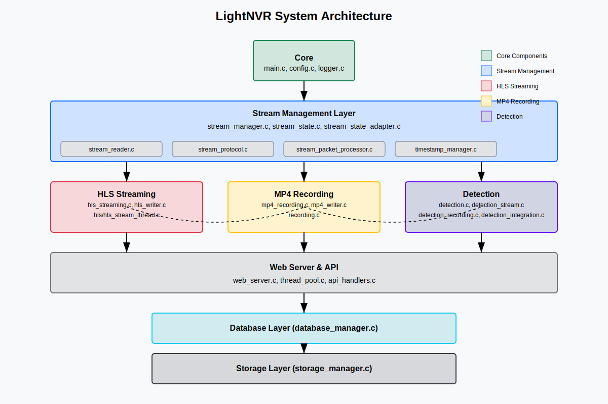
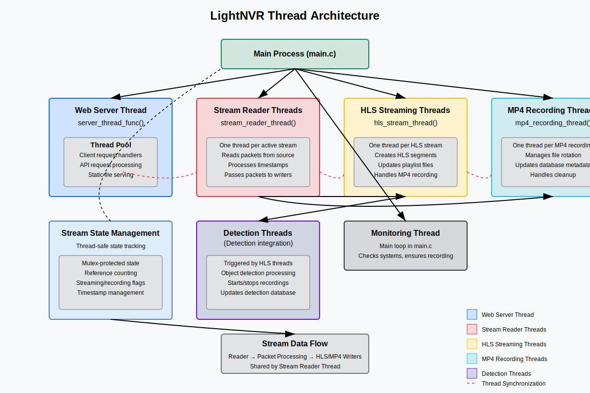
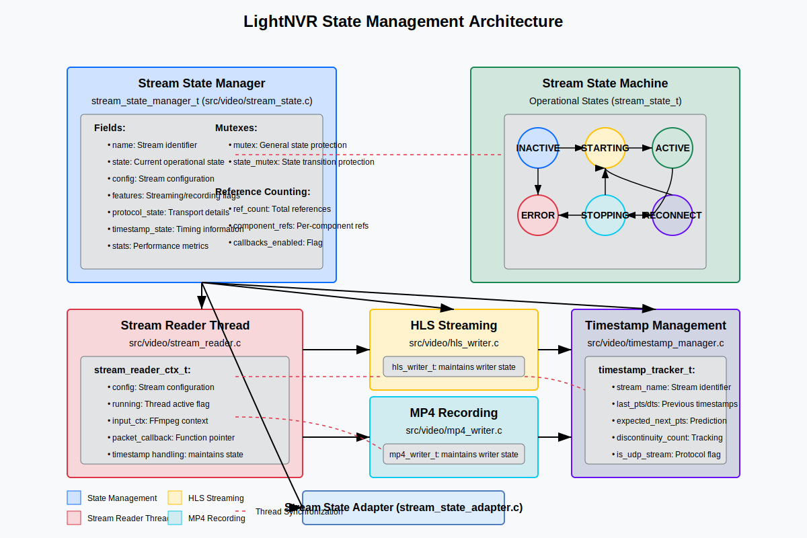

# LightNVR Architecture

This document describes the architecture and internal design of the LightNVR system.

## Overview

LightNVR is designed with a modular architecture that prioritizes memory efficiency and reliability. The system is composed of several key components that work together to provide a complete Network Video Recorder solution.

The architecture centers on **go2rtc** as the primary streaming backbone, with LightNVR providing configuration management, recording, detection, and a unified web interface.

## Overall Architecture


## Thread Architecture


## State Management Architecture


## High-Level Data Flow

```
┌─────────────┐     RTSP/ONVIF      ┌─────────────────────────────────────────────────┐
│   Cameras   │────────────────────▶│                    go2rtc                       │
│             │                     │  (Managed by LightNVR as child process)         │
└─────────────┘                     │                                                 │
                                    │  ┌─────────┐  ┌─────────┐  ┌─────────────────┐  │
                                    │  │  RTSP   │  │  WebRTC │  │  HLS/frame.jpeg │  │
                                    │  │ Server  │  │ Server  │  │    Endpoints    │  │
                                    │  │ :8554   │  │         │  │     :1984       │  │
                                    │  └────┬────┘  └────┬────┘  └────────┬────────┘  │
                                    └───────┼───────────┼─────────────────┼───────────┘
                                            │           │                 │
            ┌───────────────────────────────┼───────────┼─────────────────┼───────────┐
            │                   LightNVR    │           │                 │           │
            │                               ▼           ▼                 ▼           │
            │  ┌──────────────────────────────────────────────────────────────────┐   │
            │  │                        Web Interface                              │   │
            │  │  Live View (WebRTC/HLS) │ Recordings │ Settings │ Detection      │   │
            │  └──────────────────────────────────────────────────────────────────┘   │
            │                               │                     │                   │
            │              ┌────────────────┴───────┐   ┌─────────┴─────────┐         │
            │              ▼                        ▼   ▼                   ▼         │
            │  ┌─────────────────┐    ┌─────────────────────┐   ┌────────────────┐    │
            │  │  MP4 Recording  │    │   HLS Streaming     │   │   Detection    │    │
            │  │   (FFmpeg lib)  │    │   (FFmpeg lib)      │   │   (TFLite/     │    │
            │  │                 │    │                     │   │  SOD/API)      │    │
            │  └────────┬────────┘    └──────────┬──────────┘   └───────┬────────┘    │
            │           │                        │                      │             │
            │           ▼                        ▼                      ▼             │
            │  ┌──────────────────────────────────────────────────────────────────┐   │
            │  │                      SQLite Database                              │   │
            │  │  streams │ recordings │ detections │ zones │ users │ settings    │   │
            │  └──────────────────────────────────────────────────────────────────┘   │
            │           │                        │                                    │
            │           ▼                        ▼                                    │
            │  ┌──────────────────────────────────────────────────────────────────┐   │
            │  │                      Storage (/var/lib/lightnvr)                  │   │
            │  │  recordings/mp4/  │  recordings/hls/  │  lightnvr.db              │   │
            │  └──────────────────────────────────────────────────────────────────┘   │
            └─────────────────────────────────────────────────────────────────────────┘
```

### Core System

The core system is responsible for:
- Application lifecycle management
- Configuration loading and validation
- Signal handling and graceful shutdown
- Daemon mode operation
- PID file management
- Logging
- **go2rtc process management** (starting, monitoring, stopping)

Key files:
- `src/core/main.c`: Main entry point and application lifecycle
- `src/core/config.c`: Configuration loading and management
- `src/core/daemon.c`: Daemon mode functionality
- `src/core/logger.c`: Logging system
- `src/core/shutdown_coordinator.c`: Coordinated shutdown of all components

### go2rtc Integration (Primary Streaming)

**go2rtc is the heart of LightNVR's streaming architecture.** It handles:
- Direct camera connections (RTSP, ONVIF, HTTP, etc.)
- WebRTC streaming for ultra-low-latency live viewing
- RTSP server for local re-streaming (used by MP4/HLS recorders)
- HLS segment generation
- Frame extraction via `frame.jpeg` endpoint (used for detection)
- Two-way audio (backchannel) support

Key files:
- `src/video/go2rtc/go2rtc_process.c`: Process lifecycle management
- `src/video/go2rtc/go2rtc_stream.c`: Stream registration and API communication
- `src/video/go2rtc/go2rtc_integration.c`: Integration layer with LightNVR
- `src/video/go2rtc/go2rtc_consumer.c`: Recording consumer management
- `src/video/go2rtc/go2rtc_health.c`: Health monitoring and auto-restart

See [GO2RTC_INTEGRATION.md](GO2RTC_INTEGRATION.md) for detailed documentation.

### Video Subsystem

The video subsystem handles:
- Stream management (stream state, configuration)
- **go2rtc coordination** (registering streams, getting RTSP URLs)
- Recording to disk (MP4 and HLS formats)
- Detection-based recording triggers

Key files:
- `src/video/stream_manager.c`: Manages stream state and configuration
- `src/video/streams.c`: Stream state implementation
- `src/video/hls_writer.c`: HLS (HTTP Live Streaming) recording
- `src/video/hls_writer_thread.c`: HLS streaming thread
- `src/video/mp4_writer.c`: MP4 recording
- `src/video/mp4_recording.c`: MP4 recording thread management

### Detection Subsystem

The detection subsystem provides object detection and motion detection:
- **Object Detection**: TensorFlow Lite models, SOD (Simple Object Detection), or external API
- **Motion Detection**: ONVIF-based motion events from cameras
- **Detection Zones**: Polygon-based regions of interest per stream
- **Detection-triggered recording**: Start/stop recordings based on detection events

Key files:
- `src/video/detection_recording.c`: Detection-based recording logic
- `src/video/detection_stream_thread.c`: Per-stream detection thread
- `src/video/detection_integration.c`: Model loading (TFLite/SOD/API)
- `src/video/onvif_motion_recording.c`: ONVIF motion event handling
- `src/video/motion_buffer.c`: Pre-event circular buffer for motion recordings

See [SOD_INTEGRATION.md](SOD_INTEGRATION.md) and [ONVIF_MOTION_RECORDING.md](ONVIF_MOTION_RECORDING.md) for details.

### Storage Subsystem

The storage subsystem is responsible for:
- Managing recording storage with per-stream directories
- Implementing retention policies (standard vs detection recordings)
- Disk space management and automatic cleanup
- File organization by date

Key files:
- `src/storage/storage_manager.c`: Storage management implementation
- `src/database/db_recordings.c`: Recording metadata and retention queries

### Database Subsystem

The database subsystem handles:
- Stream configurations (SQLite)
- Recording metadata with trigger types
- Detection results and zones
- User authentication and sessions
- ONVIF motion configuration

Key files:
- `src/database/db_core.c`: Database initialization and core tables
- `src/database/db_schema.c`: Schema migrations and versioning
- `src/database/db_streams.c`: Stream configuration CRUD
- `src/database/db_recordings.c`: Recording metadata operations
- `src/database/db_detections.c`: Detection result storage
- `src/database/db_zones.c`: Detection zone management

### Web Interface

The web interface provides:
- **Live viewing** via WebRTC (low latency) or HLS (compatibility)
- Recording playback with timeline scrubbing
- Stream configuration with detection zone editor
- System settings and user management
- REST API for programmatic access

Key files:
- `src/web/mongoose_server.c`: Web server implementation using Mongoose
- `src/web/api_handlers.c`: API request routing
- `src/web/api_handlers_streams*.c`: Stream API endpoints
- `src/web/api_handlers_recordings*.c`: Recording API endpoints
- `src/web/api_handlers_detection*.c`: Detection API endpoints
- `web/js/components/preact/`: Preact components for the SPA

## Memory Management

LightNVR is designed to be memory-efficient, with several strategies employed:

### go2rtc Memory Efficiency

- go2rtc handles all camera connections and transcoding
- LightNVR only receives re-streamed video for recording
- Frame extraction for detection uses JPEG snapshots (not decoded video)

### Motion Buffer (Pre-Event Recording)

- Circular buffer of AVPackets for ONVIF motion detection
- Configurable duration (5-30 seconds)
- Memory-efficient packet cloning
- See [MOTION_BUFFER.md](MOTION_BUFFER.md)

### Swap Support

- Optional swap file for additional virtual memory
- Configurable swap size
- Used for non-critical operations to free physical memory for stream processing

## Thread Model

LightNVR uses a multi-threaded architecture:

1. **Main Thread**: Application lifecycle, signal handling, shutdown coordination
2. **go2rtc Process**: Separate process managed by LightNVR (handles all camera I/O)
3. **Mongoose Server Thread**: HTTP/WebSocket event loop
4. **Per-Request Threads**: API requests handled in thread pool
5. **HLS Writer Threads**: One per stream writing HLS segments
6. **MP4 Recording Threads**: One per active MP4 recording
7. **Detection Threads**: One per stream with detection enabled
8. **ONVIF Motion Threads**: Event subscription threads per motion-enabled stream
9. **Health Monitor Thread**: Monitors go2rtc and stream health

Thread synchronization uses mutexes and condition variables. The shutdown coordinator ensures ordered cleanup.

## Data Flow

### Stream Processing Flow (go2rtc-based)

```
Camera (RTSP/ONVIF)
       │
       ▼
   go2rtc ──────────────────────────────┬─────────────────────┐
       │                                │                     │
       │ WebRTC                         │ HLS                 │ RTSP
       ▼                                ▼                     ▼
   Browser                      LightNVR HLS          LightNVR MP4
  (Live View)                    Writer Thread         Recording
                                       │                     │
                                       ▼                     ▼
                               HLS Segments (.ts)      MP4 Files
                                       │                     │
                               (Detection Thread          Database
                                analyzes segments)        Metadata
```

1. **Camera → go2rtc**: go2rtc connects to cameras via RTSP/ONVIF/HTTP
2. **go2rtc → Browser**: WebRTC for low-latency live viewing
3. **go2rtc → HLS Writer**: Consumes go2rtc's RTSP output, writes .ts segments
4. **go2rtc → MP4 Recorder**: Consumes go2rtc's RTSP output, writes MP4 files
5. **HLS Segments → Detection**: Detection thread analyzes newest segments
6. **Detection → Recording Trigger**: Detections can start/stop MP4 recordings

### Web Interface Flow

1. User accesses web interface via browser
2. Web server authenticates the user (session token or Basic Auth)
3. Web server serves the SPA (Single Page Application)
4. Client-side Preact app makes API requests
5. **Live viewing**: Browser connects directly to go2rtc for WebRTC/HLS
6. **Recording playback**: Browser requests MP4/HLS from LightNVR API

## Database Schema

LightNVR uses SQLite for data storage with the following main tables:

### Streams Table

Stores stream configuration:
```sql
CREATE TABLE streams (
    id INTEGER PRIMARY KEY AUTOINCREMENT,
    name TEXT NOT NULL UNIQUE,
    url TEXT NOT NULL,
    enabled INTEGER DEFAULT 1,
    streaming_enabled INTEGER DEFAULT 1,
    width INTEGER DEFAULT 1920,
    height INTEGER DEFAULT 1080,
    fps INTEGER DEFAULT 30,
    codec TEXT DEFAULT 'h264',
    priority INTEGER DEFAULT 5,
    record INTEGER DEFAULT 0,
    segment_duration INTEGER DEFAULT 900,
    detection_based_recording INTEGER DEFAULT 0,
    detection_model TEXT DEFAULT '',
    detection_threshold REAL DEFAULT 0.5,
    detection_interval INTEGER DEFAULT 1000,
    pre_detection_buffer INTEGER DEFAULT 0,
    post_detection_buffer INTEGER DEFAULT 3,
    protocol TEXT DEFAULT 'tcp',
    onvif_enabled INTEGER DEFAULT 0,
    onvif_port INTEGER DEFAULT 80,
    onvif_username TEXT DEFAULT '',
    onvif_password TEXT DEFAULT '',
    ptz_enabled INTEGER DEFAULT 0,
    motion_detection_enabled INTEGER DEFAULT 0,
    retention_days INTEGER DEFAULT 7
);
```

### Recordings Table

Stores recording metadata:
```sql
CREATE TABLE recordings (
    id INTEGER PRIMARY KEY AUTOINCREMENT,
    stream_name TEXT NOT NULL,
    file_path TEXT NOT NULL,
    start_time INTEGER NOT NULL,
    end_time INTEGER,
    size INTEGER DEFAULT 0,
    trigger_type TEXT DEFAULT 'scheduled',  -- 'scheduled', 'detection', 'motion'
    protected INTEGER DEFAULT 0,
    is_complete INTEGER DEFAULT 0
);
```

### Detections Table

Stores detection results:
```sql
CREATE TABLE detections (
    id INTEGER PRIMARY KEY AUTOINCREMENT,
    stream_name TEXT NOT NULL,
    timestamp INTEGER NOT NULL,
    label TEXT NOT NULL,
    confidence REAL NOT NULL,
    x REAL, y REAL, width REAL, height REAL
);
```

### Detection Zones Table

Stores polygon-based detection regions:
```sql
CREATE TABLE detection_zones (
    id INTEGER PRIMARY KEY AUTOINCREMENT,
    stream_name TEXT NOT NULL,
    zone_name TEXT NOT NULL,
    points TEXT NOT NULL,  -- JSON array of {x, y} points
    enabled INTEGER DEFAULT 1
);
```

### Users Table

Stores user authentication information:
```sql
CREATE TABLE users (
    id INTEGER PRIMARY KEY AUTOINCREMENT,
    username TEXT NOT NULL UNIQUE,
    password_hash TEXT NOT NULL,
    salt TEXT NOT NULL,
    role TEXT NOT NULL,  -- 'admin', 'user', 'viewer'
    created_at INTEGER NOT NULL,
    last_login INTEGER
);
```

### Sessions Table

Stores active user sessions:
```sql
CREATE TABLE sessions (
    id INTEGER PRIMARY KEY AUTOINCREMENT,
    user_id INTEGER NOT NULL,
    token TEXT NOT NULL UNIQUE,
    created_at INTEGER NOT NULL,
    expires_at INTEGER NOT NULL,
    FOREIGN KEY (user_id) REFERENCES users(id)
);
```

## API Design

The LightNVR API follows RESTful principles:

- Resources are identified by URLs
- Standard HTTP methods (GET, POST, PUT, DELETE) for CRUD operations
- JSON for data exchange using cJSON library
- Authentication via session tokens or HTTP Basic Auth
- Proper status codes for success/error conditions

See [API.md](API.md) for detailed API documentation.

## Frontend Architecture

The frontend is a Single Page Application (SPA):

- **Preact** for component-based UI development
- **Tailwind CSS** for styling and responsive design
- **WebRTC** for low-latency live viewing (via go2rtc)
- **HLS.js** for fallback streaming compatibility

Key components:
- `web/js/components/preact/LiveView.jsx`: Live camera grid with WebRTC/HLS
- `web/js/components/preact/RecordingsView.jsx`: Recording browser and playback
- `web/js/components/preact/StreamConfigModal.jsx`: Stream configuration with detection zones
- `web/js/components/preact/SettingsView.jsx`: System settings
- `web/js/services/`: API client services

## Configuration System

Configuration is stored in SQLite database:

- Default values are provided for all settings
- Configuration can be updated via the API or web UI
- Changes are persisted immediately
- Some settings (like go2rtc port) require a restart

See [CONFIGURATION.md](CONFIGURATION.md) for detailed configuration documentation.

## Memory Optimization for Ingenic A1

The Ingenic A1 SoC has only 256MB of RAM, requiring specific optimizations:

1. **go2rtc Efficiency**: go2rtc handles camera connections, reducing LightNVR memory usage
2. **Staggered Initialization**: Streams are initialized one at a time to prevent memory spikes
3. **JPEG-based Detection**: Uses go2rtc's `frame.jpeg` endpoint instead of decoding video
4. **Swap Support**: Optional swap file for additional virtual memory
5. **Priority System**: Ensures critical streams get resources when memory is constrained

## Shutdown Coordination System

LightNVR implements a robust shutdown coordination system to ensure clean and orderly shutdown of all components.

The shutdown coordination system follows a priority-based approach to ensure components shut down in the correct dependency order:

1. **Detection Threads** (highest priority - 100): Shut down first since they depend on both MP4 writers and HLS streaming
2. **MP4 Writers** (medium priority - 80): Shut down second since they depend on HLS streaming
3. **HLS Streaming Threads** (lowest priority - 60): Shut down last as they are the foundation
4. **go2rtc Process** (final): Terminated after all consumers are stopped

### Key Components

1. **Shutdown Coordinator** (`include/core/shutdown_coordinator.h` and `src/core/shutdown_coordinator.c`)
   - Centralized management of component registration and shutdown sequence
   - Atomic operations for thread safety with minimal mutex usage
   - Component state tracking during shutdown
   - Priority-based shutdown sequencing
   - Timeout mechanism to prevent hanging

2. **Component Integration**
   - Components register with the coordinator during initialization
   - Components check for shutdown signals in their main loops
   - Components update their state when exiting
   - Coordinator tracks component states during shutdown

### Shutdown Sequence

1. Main process initiates shutdown (via signal handler or user request)
2. Coordinator sets shutdown flag and notifies components in priority order
3. Components check shutdown flag in their main loops and begin cleanup
4. Components release shared resources and update their state
5. Coordinator waits for all components to stop (with timeout)
6. go2rtc process is terminated
7. Main process performs final cleanup when all components are stopped

This system prevents race conditions, deadlocks, and memory corruption during shutdown by ensuring components are stopped in the correct order and resources are properly released.

## Error Handling and Recovery

LightNVR is designed to be robust and self-healing:

1. **go2rtc Health Monitoring**: Monitors go2rtc API and restarts on failure
2. **Stream Reconnection**: go2rtc automatically reconnects to streams after network issues
3. **Graceful Degradation**: Reduces functionality rather than crashing when resources are constrained
4. **Safe Shutdown**: Ensures recordings are properly finalized during shutdown
5. **Crash Recovery**: Recovers state from database after unexpected shutdowns

## Security Considerations

LightNVR implements several security measures:

1. **Session-based Authentication**: Secure token-based sessions with expiration
2. **Password Hashing**: Passwords are stored as salted hashes
3. **Input Validation**: All user input is validated to prevent injection attacks
4. **Role-based Access**: Admin, user, and viewer roles
5. **Minimal Dependencies**: Reduces attack surface by minimizing external dependencies

## Future Architecture Enhancements

Planned architectural improvements:

1. **Pre-detection Buffer**: AVPacket-level ring buffer for capturing video before detection events
2. **go2rtc Native Recording**: Use go2rtc's built-in recording capabilities
3. **Hardware Acceleration**: Better support for hardware-accelerated video processing
4. **Event System**: More sophisticated event handling and notifications (webhooks, MQTT)
5. **Multi-model Detection**: Support for multiple detection models per stream
