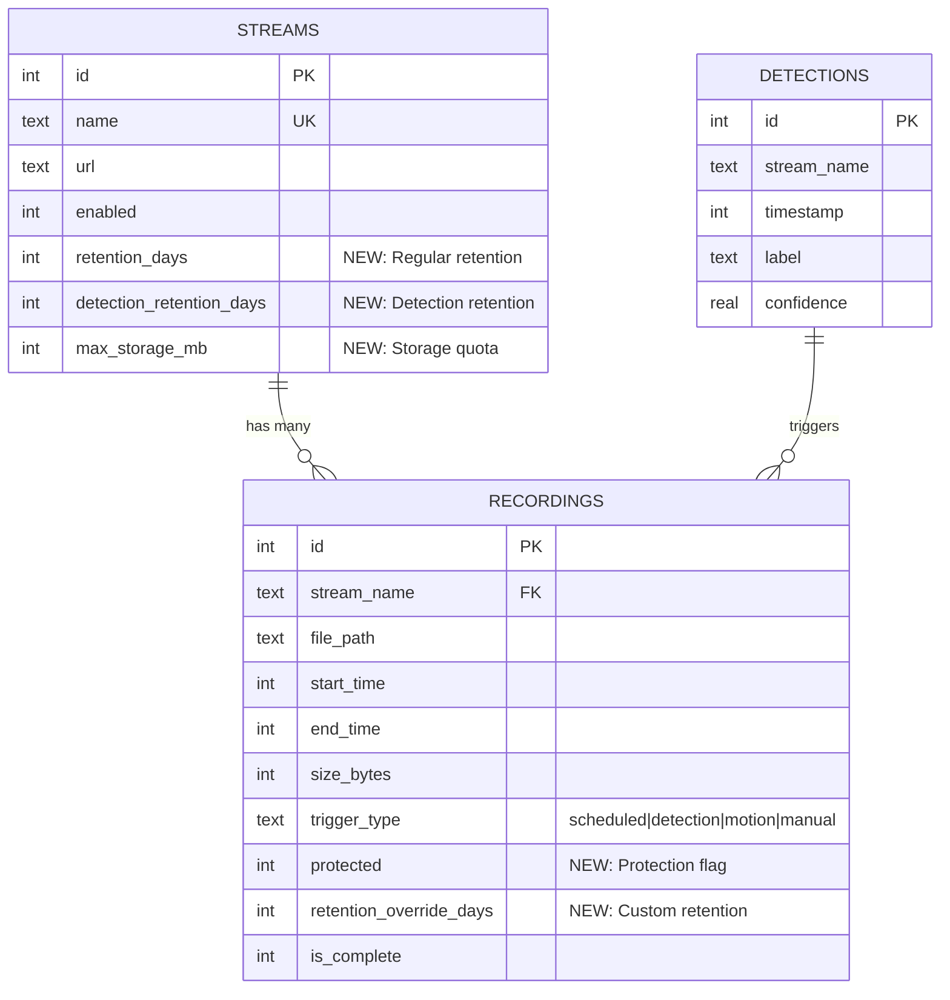
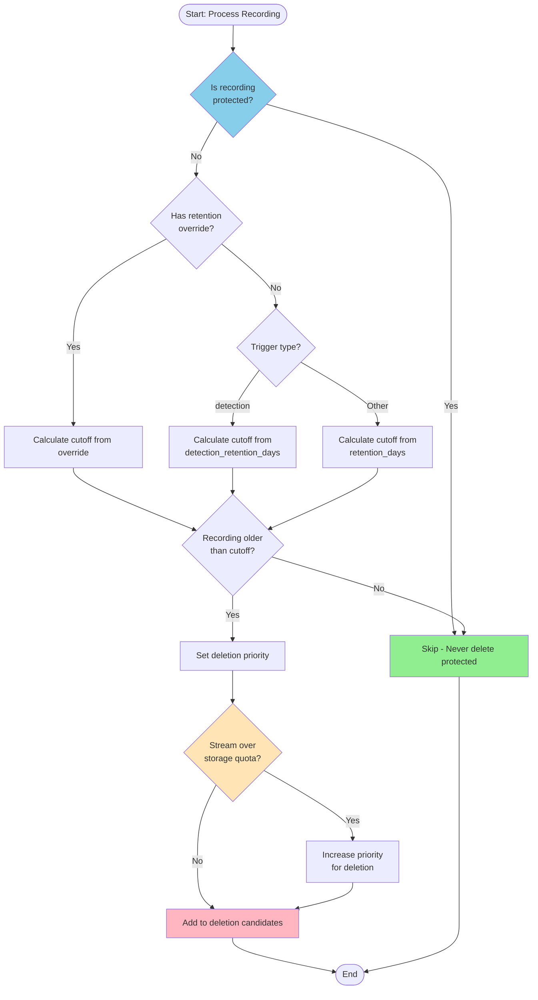
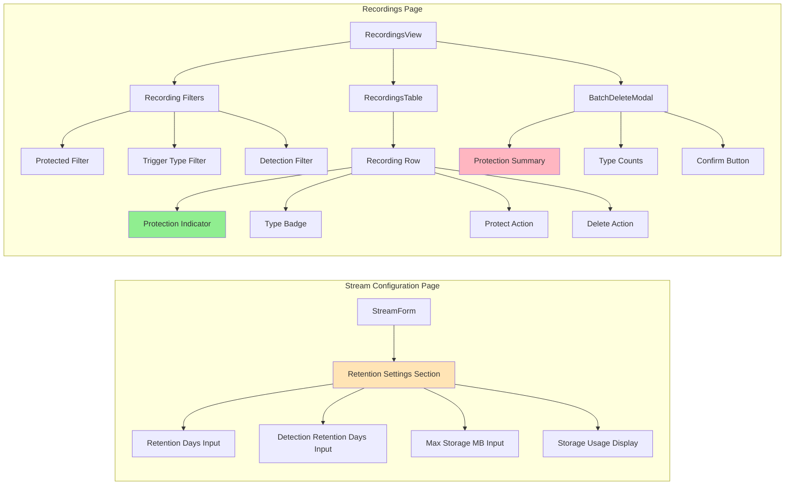

# Implementation Plan: Per-Stream Recording Retention Policies

## Overview
This document provides a detailed, step-by-step implementation plan for the sophisticated per-stream recording retention policies feature, following C best practices and lightweight design principles.

## Prerequisites
- SQLite3 development libraries
- Existing lightNVR codebase with storage_manager and database modules
- Understanding of current retention policy in `storage_manager.c`

## Phase 1: Database Schema & Core Infrastructure (Week 1)

### Database Schema Overview



### Task 1.1: Database Schema Migration
**File**: `src/database/db_schema.c`

**Steps:**
1. Add migration function `migration_v11_to_v12()`
2. Add columns to `streams` table:
   - `retention_days INTEGER DEFAULT 30`
   - `detection_retention_days INTEGER DEFAULT 90`
   - `max_storage_mb INTEGER DEFAULT 0`
3. Add columns to `recordings` table:
   - `protected INTEGER DEFAULT 0`
   - `retention_override_days INTEGER DEFAULT NULL`
4. Create indexes for performance:
   - `idx_recordings_protected ON recordings(protected)`
   - `idx_recordings_trigger_type ON recordings(trigger_type)`
   - `idx_recordings_stream_time ON recordings(stream_name, start_time)`
5. Update `CURRENT_SCHEMA_VERSION` to 12
6. Add migration to migration array

**Testing:**
- Test migration from v11 to v12
- Verify indexes created
- Test rollback safety

### Task 1.2: Stream Retention Configuration Structure
**File**: `include/database/db_streams.h`

**Steps:**
1. Add `stream_retention_config_t` structure:
```c
typedef struct {
    int retention_days;              // Regular recordings retention
    int detection_retention_days;    // Detection recordings retention
    uint64_t max_storage_mb;        // Storage quota (0 = unlimited)
} stream_retention_config_t;
```

2. Add function declarations:
```c
int get_stream_retention_config(const char *stream_name, stream_retention_config_t *config);
int set_stream_retention_config(const char *stream_name, const stream_retention_config_t *config);
int get_stream_storage_usage(const char *stream_name, uint64_t *size_bytes);
```

### Task 1.3: Implement Stream Retention Config Functions
**File**: `src/database/db_streams.c`

**Steps:**
1. Implement `get_stream_retention_config()`:
   - Query streams table for retention columns
   - Use prepared statement
   - Return defaults if stream not found
   
2. Implement `set_stream_retention_config()`:
   - Update streams table with new retention values
   - Use prepared statement
   - Validate inputs (retention_days >= 0, etc.)

3. Implement `get_stream_storage_usage()`:
   - Query SUM(size_bytes) from recordings WHERE stream_name = ?
   - Return total bytes used by stream

**Testing:**
- Test get/set with valid streams
- Test with non-existent streams
- Test boundary values (0, negative, very large)

### Task 1.4: Recording Protection Functions
**File**: `include/database/db_recordings.h` and `src/database/db_recordings.c`

**Steps:**
1. Add function declarations in header:
```c
int set_recording_protected(uint64_t recording_id, bool protected);
int set_recording_retention_override(uint64_t recording_id, int days);
int get_protected_recordings_count(const char *stream_name);
```

2. Implement in `db_recordings.c`:
   - `set_recording_protected()`: UPDATE recordings SET protected = ? WHERE id = ?
   - `set_recording_retention_override()`: UPDATE recordings SET retention_override_days = ? WHERE id = ?
   - `get_protected_recordings_count()`: SELECT COUNT(*) WHERE protected = 1

**Testing:**
- Test protection flag toggle
- Test retention override
- Test count queries

## Phase 2: Enhanced Retention Policy Engine (Week 2)

### Deletion Decision Flowchart



### Task 2.1: Refactor Retention Policy Structure
**File**: `src/storage/storage_manager.c`

**Steps:**
1. Create helper structure for deletion candidates:
```c
typedef struct {
    uint64_t id;
    char file_path[256];
    time_t start_time;
    uint64_t size_bytes;
    int priority;  // Lower = delete first
} deletion_candidate_t;
```

2. Create helper functions:
   - `collect_deletion_candidates()` - Query recordings eligible for deletion
   - `sort_candidates_by_priority()` - Sort by priority, then age
   - `delete_candidate_recordings()` - Delete files and DB entries
   - `calculate_deletion_priority()` - Determine priority based on rules

### Task 2.2: Implement Per-Stream Retention Logic
**File**: `src/storage/storage_manager.c`

**Steps:**
1. Create `apply_retention_policy_for_stream()`:
```c
static int apply_retention_policy_for_stream(const char *stream_name) {
    // Load stream retention config
    stream_retention_config_t config;
    get_stream_retention_config(stream_name, &config);

    // Calculate cutoff times
    time_t now = time(NULL);
    time_t regular_cutoff = now - (config.retention_days * 86400);
    time_t detection_cutoff = now - (config.detection_retention_days * 86400);

    // Collect deletion candidates with priorities
    deletion_candidate_t candidates[1000];
    int candidate_count = 0;

    // Priority 1: Regular recordings past retention, unprotected
    candidate_count += query_recordings_for_deletion(
        stream_name, regular_cutoff,
        "trigger_type != 'detection' AND protected = 0 AND retention_override_days IS NULL",
        candidates, 1000, 1);

    // Priority 2: Detection recordings past detection retention, unprotected
    candidate_count += query_recordings_for_deletion(
        stream_name, detection_cutoff,
        "trigger_type = 'detection' AND protected = 0 AND retention_override_days IS NULL",
        candidates + candidate_count, 1000 - candidate_count, 2);

    // Sort by priority, then age
    qsort(candidates, candidate_count, sizeof(deletion_candidate_t), compare_candidates);

    // Delete candidates
    int deleted = delete_candidate_recordings(candidates, candidate_count);

    // Check storage quota
    if (config.max_storage_mb > 0) {
        deleted += enforce_storage_quota(stream_name, config.max_storage_mb);
    }

    return deleted;
}
```

2. Refactor `apply_retention_policy()` to iterate streams:
```c
int apply_retention_policy(void) {
    // Get all stream names
    char stream_names[MAX_STREAMS][64];
    int stream_count = get_all_stream_names(stream_names, MAX_STREAMS);

    int total_deleted = 0;
    for (int i = 0; i < stream_count; i++) {
        int deleted = apply_retention_policy_for_stream(stream_names[i]);
        if (deleted > 0) {
            log_info("Deleted %d recordings for stream %s", deleted, stream_names[i]);
            total_deleted += deleted;
        }
    }

    return total_deleted;
}
```

**Testing:**
- Test with multiple streams with different retention configs
- Test priority ordering
- Test protected recordings are never deleted
- Test storage quota enforcement

### Task 2.3: Implement Storage Quota Enforcement
**File**: `src/storage/storage_manager.c`

**Steps:**
1. Create `enforce_storage_quota()`:
```c
static int enforce_storage_quota(const char *stream_name, uint64_t max_mb) {
    // Get current usage
    uint64_t current_bytes;
    get_stream_storage_usage(stream_name, &current_bytes);

    uint64_t max_bytes = max_mb * 1024 * 1024;
    if (current_bytes <= max_bytes) {
        return 0;  // Under quota
    }

    // Need to delete oldest unprotected recordings
    uint64_t bytes_to_free = current_bytes - max_bytes;

    // Query oldest unprotected recordings
    deletion_candidate_t candidates[1000];
    int count = query_oldest_unprotected_recordings(
        stream_name, candidates, 1000, bytes_to_free);

    // Delete until under quota
    return delete_candidate_recordings(candidates, count);
}
```

**Testing:**
- Test quota enforcement with various sizes
- Test with all protected recordings (should log warning)
- Test quota calculation accuracy

### Task 2.4: Orphaned Recording Cleanup
**File**: `src/storage/storage_manager.c`

**Steps:**
1. Create `cleanup_orphaned_files()`:
   - Scan storage directory for .mp4 files
   - Check if each file exists in database
   - Delete files not in database
   - Log orphaned files

2. Create `cleanup_orphaned_db_entries()`:
   - Query all recordings from database
   - Check if file exists on disk
   - Delete DB entries for missing files
   - Log orphaned entries

3. Add to storage manager thread:
```c
// Run orphan cleanup every 24 hours
if (difftime(now, last_orphan_cleanup) > 86400) {
    cleanup_orphaned_files();
    cleanup_orphaned_db_entries();
    last_orphan_cleanup = now;
}
```

**Testing:**
- Test with orphaned files
- Test with orphaned DB entries
- Test performance with large directories

## Phase 3: API Endpoints (Week 3)

### Task 3.1: Stream Retention Configuration API
**File**: `src/web/api_handlers_streams_modify.c`

**Steps:**
1. Enhance `mg_handle_update_stream()` to accept retention fields:
```c
// Parse retention fields from JSON
cJSON *retention_days = cJSON_GetObjectItem(json, "retention_days");
cJSON *detection_retention_days = cJSON_GetObjectItem(json, "detection_retention_days");
cJSON *max_storage_mb = cJSON_GetObjectItem(json, "max_storage_mb");

// Update retention config if provided
if (retention_days || detection_retention_days || max_storage_mb) {
    stream_retention_config_t config;
    get_stream_retention_config(stream_name, &config);

    if (retention_days) config.retention_days = retention_days->valueint;
    if (detection_retention_days) config.detection_retention_days = detection_retention_days->valueint;
    if (max_storage_mb) config.max_storage_mb = max_storage_mb->valueint;

    set_stream_retention_config(stream_name, &config);
}
```

2. Enhance `mg_handle_get_stream()` to include retention fields in response

**Testing:**
- Test PATCH with retention fields
- Test GET returns retention fields
- Test validation of retention values

### Task 3.2: Recording Protection API
**File**: `src/web/api_handlers_recordings.c` (new functions)

**Steps:**
1. Create `mg_handle_protect_recording()`:
```c
void mg_handle_protect_recording(struct mg_connection *c, struct mg_http_message *hm) {
    // Extract recording ID from URL
    // Parse JSON body for protected flag and retention_override_days
    // Call set_recording_protected() and set_recording_retention_override()
    // Send success response
}
```

2. Add route in `mongoose_server_handlers.c`:
```c
if (mg_http_match_uri(hm, "/api/recordings/*/protect")) {
    mg_handle_protect_recording(c, hm);
}
```

3. Enhance `get_recording_metadata_paginated()` to support protected filter

**Testing:**
- Test PATCH /api/recordings/:id/protect
- Test GET /api/recordings?protected=true
- Test protection flag in responses

### Task 3.3: Enhanced Batch Delete API
**File**: `src/web/api_handlers_recordings_batch.c`

**Steps:**
1. Enhance `batch_delete_recordings_task_function()` to:
   - Parse `protected` filter from request
   - Add WHERE clause: `AND protected = 0` (never delete protected)
   - Count protected recordings excluded
   - Return detailed summary

2. Update response format:
```json
{
  "success": true,
  "deleted": 45,
  "failed": 0,
  "protected_excluded": 5,
  "breakdown": {
    "scheduled": 30,
    "detection": 15
  }
}
```

**Testing:**
- Test batch delete excludes protected recordings
- Test response includes protection info
- Test filter combinations

## Phase 4: UI Enhancements (Week 4)

### UI Component Structure



### Task 4.1: Stream Configuration UI
**File**: `web/js/components/preact/StreamForm.jsx`

**Steps:**
1. Add retention fields to form:
```jsx
<div className="form-group">
  <label>Retention Days (Regular)</label>
  <input type="number" name="retention_days"
         value={stream.retention_days || 30} />
</div>
<div className="form-group">
  <label>Retention Days (Detections)</label>
  <input type="number" name="detection_retention_days"
         value={stream.detection_retention_days || 90} />
</div>
<div className="form-group">
  <label>Max Storage (MB, 0=unlimited)</label>
  <input type="number" name="max_storage_mb"
         value={stream.max_storage_mb || 0} />
</div>
```

2. Add storage usage display (query from API)

**Testing:**
- Test form submission with retention fields
- Test validation
- Test display of current values

### Task 4.2: Recordings Table Enhancements
**File**: `web/js/components/preact/recordings/RecordingsTable.jsx`

**Steps:**
1. Add "Protected" column with lock icon
2. Add "Type" badge for trigger_type
3. Add "Protect" button to actions
4. Add filter controls for protected and trigger_type

**Testing:**
- Test protection toggle
- Test filtering by protection status
- Test visual indicators

### Task 4.3: Enhanced Batch Delete Modal
**File**: `web/js/components/preact/BatchDeleteModal.jsx`

**Steps:**
1. Add protection status to confirmation dialog:
```jsx
<div className="deletion-summary">
  <p>Delete {totalCount} recordings:</p>
  <ul>
    <li>{scheduledCount} scheduled recordings</li>
    <li>{detectionCount} detection recordings</li>
    <li className="text-warning">{protectedCount} protected (excluded)</li>
  </ul>
</div>
```

2. Query protection counts before showing modal
3. Update progress display to show protection exclusions

**Testing:**
- Test modal shows accurate counts
- Test protected recordings excluded
- Test progress updates

## Phase 5: Testing & Documentation (Week 5)

### Task 5.1: Unit Tests
**Files**: `tests/test_retention_policy.c`, `tests/test_recording_protection.c`

**Test Cases:**
1. Retention policy with various configurations
2. Protection flag prevents deletion
3. Retention override works correctly
4. Storage quota enforcement
5. Orphaned file cleanup
6. Priority ordering of deletions
7. Edge cases (all protected, zero retention, etc.)

### Task 5.2: Integration Tests
**File**: `tests/integration/test_retention_integration.c`

**Test Scenarios:**
1. Full cleanup cycle with real database
2. Concurrent protection and deletion
3. Large dataset performance (10K recordings)
4. Migration from v11 to v12
5. API endpoint integration

### Task 5.3: Performance Testing
**File**: `tests/performance/test_retention_performance.c`

**Benchmarks:**
1. Cleanup time for 10K, 100K recordings
2. Memory usage during cleanup
3. Database query performance with indexes
4. Concurrent API requests

### Task 5.4: Documentation
**Files**:
- `docs/API.md` - Update with new endpoints
- `docs/USER_GUIDE.md` - Add retention policy guide
- `README.md` - Update features list

**Content:**
1. API documentation for new endpoints
2. User guide for configuring retention policies
3. Examples of common retention scenarios
4. Troubleshooting guide

## Implementation Checklist

### Phase 1: Database & Core (Week 1)
- [ ] Database migration v11 to v12
- [ ] Stream retention config structure
- [ ] Stream retention config functions
- [ ] Recording protection functions
- [ ] Unit tests for database functions

### Phase 2: Retention Engine (Week 2)
- [ ] Refactor retention policy structure
- [ ] Per-stream retention logic
- [ ] Storage quota enforcement
- [ ] Orphaned recording cleanup
- [ ] Unit tests for retention engine

### Phase 3: API (Week 3)
- [ ] Stream retention configuration API
- [ ] Recording protection API
- [ ] Enhanced batch delete API
- [ ] API integration tests

### Phase 4: UI (Week 4)
- [ ] Stream configuration UI
- [ ] Recordings table enhancements
- [ ] Enhanced batch delete modal
- [ ] UI integration tests

### Phase 5: Testing & Docs (Week 5)
- [ ] Comprehensive unit tests
- [ ] Integration tests
- [ ] Performance tests
- [ ] Documentation updates
- [ ] User guide

## Code Quality Standards

### C Best Practices
1. **Memory Management**:
   - Use stack allocation for small, fixed-size structures
   - Free all heap allocations in error paths
   - Use `calloc()` for zero-initialization
   - Check all allocation results

2. **Error Handling**:
   - Return -1 on error, 0 on success, positive for counts
   - Log errors with context
   - Clean up resources in error paths
   - Use goto for cleanup when appropriate

3. **Thread Safety**:
   - Use mutexes for shared state
   - Minimize lock duration
   - Use prepared statements (thread-safe in SQLite)
   - Avoid global mutable state

4. **Performance**:
   - Use indexes for all filtered queries
   - Batch database operations in transactions
   - Avoid N+1 query patterns
   - Use efficient data structures (arrays over linked lists)

5. **Code Style**:
   - Follow existing lightNVR style
   - Use descriptive variable names
   - Comment complex logic
   - Keep functions under 100 lines

### Testing Standards
1. Test all error paths
2. Test boundary conditions
3. Test with realistic data volumes
4. Test concurrent operations
5. Verify no memory leaks (valgrind)

## Rollout Strategy

### Development
1. Create feature branch: `feature/per-stream-retention`
2. Implement in phases (1-5)
3. Code review after each phase
4. Merge to main after all tests pass

### Deployment
1. **Pre-deployment**:
   - Backup database
   - Test migration on copy of production DB
   - Verify rollback procedure

2. **Deployment**:
   - Stop lightNVR service
   - Backup database
   - Update binary
   - Start service (migration runs automatically)
   - Verify migration success
   - Monitor logs for errors

3. **Post-deployment**:
   - Verify retention policies working
   - Check storage manager thread logs
   - Monitor performance metrics
   - Gather user feedback

### Rollback Plan
If issues occur:
1. Stop service
2. Restore database backup
3. Revert to previous binary
4. Restart service
5. Investigate issues offline

## Estimated Effort

| Phase | Tasks | Estimated Time |
|-------|-------|----------------|
| Phase 1: Database & Core | 4 tasks | 5 days |
| Phase 2: Retention Engine | 4 tasks | 5 days |
| Phase 3: API | 3 tasks | 5 days |
| Phase 4: UI | 3 tasks | 5 days |
| Phase 5: Testing & Docs | 4 tasks | 5 days |
| **Total** | **18 tasks** | **25 days** |

## Dependencies
- SQLite 3.x
- Existing database schema v11
- Storage manager thread infrastructure
- Web UI framework (Preact)

## Risks & Mitigation

| Risk | Impact | Mitigation |
|------|--------|------------|
| Migration failure | High | Thorough testing, backup/restore procedure |
| Performance degradation | Medium | Benchmarking, index optimization |
| Data loss | High | Protected flag, confirmation dialogs |
| Quota calculation errors | Medium | Comprehensive testing, logging |
| UI complexity | Low | Iterative design, user feedback |

## Success Criteria
1. ✅ All retention policies work as specified
2. ✅ Protected recordings never deleted automatically
3. ✅ Cleanup runs in <5 seconds for 10K recordings
4. ✅ No memory leaks detected
5. ✅ UI clearly shows protection status
6. ✅ All tests pass
7. ✅ Documentation complete
8. ✅ Zero data loss incidents


