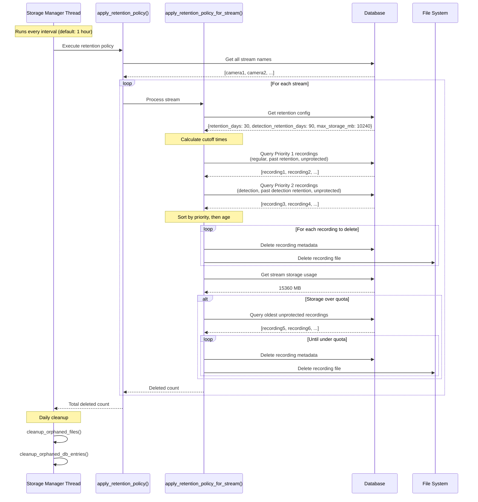
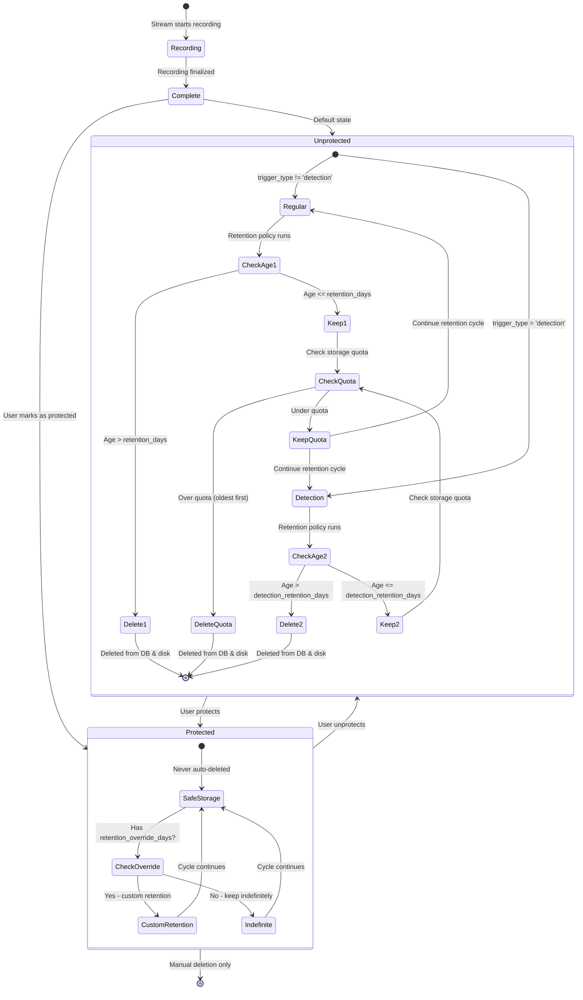

# PRD: Sophisticated Per-Stream Recording Retention Policies

## Executive Summary
Implement comprehensive, per-stream recording retention and deletion policies for lightNVR that provide fine-grained control over recording lifecycle management while maintaining the project's core principles of lightweight design and C best practices.

## Background
Currently, lightNVR has:
- Global retention policy (30 days default) in `storage_manager.c`
- Basic time-based cleanup in storage manager thread
- Motion recording config with `retention_days` and `max_storage_mb` per stream
- Manual deletion via UI (single and batch)
- Detection-based recordings with `trigger_type` field

**Gaps:**
- No per-stream retention policies for regular recordings
- No ability to preserve detection recordings indefinitely or longer than regular recordings
- No "protected" flag to prevent deletion of important recordings
- Limited cleanup sophistication (doesn't consider detection status)
- UI lacks advanced filtering for deletion operations

## Goals
1. **Per-Stream Retention Policies**: Allow different retention rules per stream
2. **Detection-Aware Retention**: Preserve recordings with detections longer than those without
3. **Protected Recordings**: Mark recordings as "do not delete"
4. **Enhanced UI**: Improve batch delete and single delete with better filtering
5. **Unified Maintenance Thread**: Consolidate cleanup responsibilities into storage manager thread

## Non-Goals
- Complex rule engines or scripting
- External storage integration
- Video content analysis for retention decisions
- User-specific retention policies

## Technical Design

### Architecture Overview



### Recording Lifecycle Flow



### 1. Database Schema Changes

#### 1.1 Add Retention Columns to `streams` Table
```sql
ALTER TABLE streams ADD COLUMN retention_days INTEGER DEFAULT 30;
ALTER TABLE streams ADD COLUMN detection_retention_days INTEGER DEFAULT 90;  -- Longer for detections
ALTER TABLE streams ADD COLUMN max_storage_mb INTEGER DEFAULT 0;  -- 0 = unlimited
```

#### 1.2 Add Protection Flag to `recordings` Table
```sql
ALTER TABLE recordings ADD COLUMN protected INTEGER DEFAULT 0;  -- 0 = can delete, 1 = protected
ALTER TABLE recordings ADD COLUMN retention_override_days INTEGER DEFAULT NULL;  -- Per-recording override
```

### 2. Core Components

#### 2.1 Per-Stream Retention Configuration (`db_streams.c`)
Add functions to manage per-stream retention settings:
- `get_stream_retention_config(stream_name, config*)`
- `set_stream_retention_config(stream_name, config*)`

#### 2.2 Enhanced Retention Policy Engine (`storage_manager.c`)
Refactor `apply_retention_policy()` to:
1. Load retention config for each stream
2. Apply different rules based on:
   - Stream-specific retention days
   - Detection status (`trigger_type` field)
   - Protected flag
   - Per-recording override
3. Respect storage quotas (per-stream `max_storage_mb`)
4. Delete oldest first within each category

**Deletion Priority (lowest to highest protection):**
1. Unprotected, non-detection recordings past stream retention
2. Unprotected, detection recordings past detection retention
3. Protected recordings (never deleted automatically)
4. Recordings with `retention_override_days` (custom handling)

#### 2.3 Recording Protection API (`db_recordings.c`)
Add functions:
- `set_recording_protected(recording_id, protected)` - Mark/unmark as protected
- `set_recording_retention_override(recording_id, days)` - Custom retention
- `get_recordings_by_protection_status(stream_name, protected, metadata*, max_count)`

#### 2.4 Enhanced Storage Manager Thread
Consolidate cleanup responsibilities:
- Apply per-stream retention policies
- Cleanup orphaned files (files without DB entries)
- Cleanup orphaned DB entries (DB entries without files)
- Vacuum database periodically
- Cleanup expired sessions (already implemented)

**Thread Responsibilities:**
```c
// In storage_manager_thread_func():
1. Apply retention policy (enhanced with per-stream logic)
2. Cleanup orphaned recordings
3. Check storage quotas per stream
4. Vacuum database (weekly)
5. Cleanup expired sessions
```

### 3. API Enhancements

#### 3.1 Stream Configuration API
**PATCH /api/streams/:name**
```json
{
  "retention_days": 30,
  "detection_retention_days": 90,
  "max_storage_mb": 10240
}
```

#### 3.2 Recording Protection API
**PATCH /api/recordings/:id/protect**
```json
{
  "protected": true,
  "retention_override_days": 365  // Optional
}
```

**GET /api/recordings?protected=true** - Filter by protection status

#### 3.3 Enhanced Batch Delete
**POST /api/recordings/batch-delete**
```json
{
  "filter": {
    "stream_name": "camera1",
    "start_time": 1234567890,
    "end_time": 1234567999,
    "has_detections": false,
    "protected": false,
    "trigger_type": "scheduled"
  }
}
```

### 4. UI Enhancements

#### 4.1 Stream Configuration Page
Add retention settings section:
- Retention Days (regular recordings)
- Detection Retention Days (recordings with detections)
- Max Storage (MB)
- Display current usage vs quota

#### 4.2 Recordings Page Enhancements
**Table Columns:**
- Add "Protected" indicator (lock icon)
- Add "Type" badge (scheduled/detection/motion/manual)

**Filtering:**
- Filter by protection status
- Filter by trigger type
- Filter by detection presence

**Actions:**
- "Protect" button on individual recordings
- "Protect Selected" bulk action
- "Delete Unprotected" bulk action
- Confirmation dialogs show protection status

#### 4.3 Batch Delete Modal Improvements
- Show count of protected recordings (excluded from deletion)
- Show breakdown by trigger type
- Confirm with detailed summary:
  ```
  Delete 45 recordings:
  - 30 scheduled recordings
  - 15 detection recordings
  - 0 protected recordings (excluded)
  ```

### 5. Implementation Details

#### 5.1 Lightweight C Best Practices
- Use stack allocation for small structures
- Minimize heap allocations in hot paths
- Use prepared statements for all DB queries
- Batch DB operations in transactions
- Efficient file scanning (avoid repeated stat calls)
- Thread-safe with minimal locking

#### 5.2 Database Migration
Add migration `v11_to_v12`:
```c
static int migration_v11_to_v12(void) {
    // Add retention columns to streams
    add_column_if_not_exists("streams", "retention_days", "INTEGER DEFAULT 30");
    add_column_if_not_exists("streams", "detection_retention_days", "INTEGER DEFAULT 90");
    add_column_if_not_exists("streams", "max_storage_mb", "INTEGER DEFAULT 0");

    // Add protection columns to recordings
    add_column_if_not_exists("recordings", "protected", "INTEGER DEFAULT 0");
    add_column_if_not_exists("recordings", "retention_override_days", "INTEGER DEFAULT NULL");

    // Create index for efficient queries
    sqlite3_exec(db, "CREATE INDEX IF NOT EXISTS idx_recordings_protected ON recordings(protected);", ...);
    sqlite3_exec(db, "CREATE INDEX IF NOT EXISTS idx_recordings_trigger_type ON recordings(trigger_type);", ...);

    return 0;
}
```

#### 5.3 Enhanced Retention Algorithm
```c
int apply_retention_policy_per_stream(const char *stream_name) {
    // 1. Load stream retention config
    stream_retention_config_t config;
    get_stream_retention_config(stream_name, &config);

    // 2. Calculate cutoff times
    time_t now = time(NULL);
    time_t regular_cutoff = now - (config.retention_days * 86400);
    time_t detection_cutoff = now - (config.detection_retention_days * 86400);

    // 3. Query recordings to delete (in priority order)
    // Priority 1: Non-detection, unprotected, past retention
    delete_recordings_by_criteria(stream_name, regular_cutoff,
                                   "trigger_type != 'detection' AND protected = 0");

    // Priority 2: Detection, unprotected, past detection retention
    delete_recordings_by_criteria(stream_name, detection_cutoff,
                                   "trigger_type = 'detection' AND protected = 0");

    // 4. Check storage quota
    if (config.max_storage_mb > 0) {
        enforce_storage_quota(stream_name, config.max_storage_mb);
    }

    return deleted_count;
}
```

## Success Metrics
1. **Functionality**: All retention policies work as specified
2. **Performance**: Cleanup runs in <5 seconds for 10,000 recordings
3. **Memory**: No memory leaks, <10MB overhead for cleanup thread
4. **Reliability**: Protected recordings never deleted automatically
5. **Usability**: UI clearly shows protection status and deletion impact

## Testing Strategy
1. **Unit Tests**: Test retention logic with various scenarios
2. **Integration Tests**: Test full cleanup cycle with real DB
3. **Performance Tests**: Benchmark with 10K, 100K recordings
4. **Edge Cases**:
   - Protected recordings with expired retention
   - Quota enforcement with all protected recordings
   - Concurrent deletion and protection changes
   - Orphaned file cleanup

## Rollout Plan
1. **Phase 1**: Database schema migration and core retention logic
2. **Phase 2**: API endpoints for protection and per-stream config
3. **Phase 3**: UI enhancements for protection and filtering
4. **Phase 4**: Enhanced batch delete with protection awareness

## Open Questions
1. Should protected recordings count toward storage quota?
   - **Recommendation**: Yes, but show warning when quota exceeded due to protected recordings
2. Default detection retention days?
   - **Recommendation**: 90 days (3x regular retention)
3. Maximum retention override?
   - **Recommendation**: 3650 days (10 years), 0 = indefinite
4. Should we support retention by file size in addition to time?
   - **Recommendation**: Phase 2 feature, not MVP


