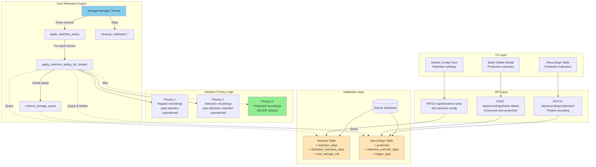

# Recording Retention Policies - Executive Summary

## Overview
This document summarizes the comprehensive per-stream recording retention and deletion policy system for lightNVR, designed to provide sophisticated lifecycle management while maintaining lightweight C best practices.

## Architecture Diagram



## Key Features

### 1. Per-Stream Retention Policies
- **Regular Retention**: Configurable retention days for standard recordings (default: 30 days)
- **Detection Retention**: Longer retention for recordings with detections (default: 90 days)
- **Storage Quotas**: Per-stream storage limits in MB (0 = unlimited)

### 2. Recording Protection
- **Protected Flag**: Mark important recordings to prevent automatic deletion
- **Retention Override**: Set custom retention period for individual recordings
- **Never Auto-Delete**: Protected recordings are never deleted by cleanup thread

### 3. Intelligent Deletion Priority
Recordings are deleted in this order (lowest to highest protection):
1. **Priority 1**: Unprotected regular recordings past retention period
2. **Priority 2**: Unprotected detection recordings past detection retention period
3. **Priority 3**: Protected recordings (NEVER deleted automatically)

### 4. Enhanced UI Features
- **Stream Configuration**: Set retention policies per stream
- **Protection Indicators**: Visual lock icons for protected recordings
- **Type Badges**: Show recording trigger type (scheduled/detection/motion/manual)
- **Advanced Filtering**: Filter by protection status, trigger type, detection presence
- **Smart Batch Delete**: Shows protection summary before deletion

### 5. Unified Maintenance Thread
The storage manager thread handles:
- Per-stream retention policy enforcement
- Storage quota enforcement
- Orphaned file cleanup (files without DB entries)
- Orphaned DB entry cleanup (DB entries without files)
- Database vacuum (weekly)
- Session cleanup (existing)

## Database Schema Changes

### Streams Table (New Columns)
```sql
retention_days INTEGER DEFAULT 30
detection_retention_days INTEGER DEFAULT 90
max_storage_mb INTEGER DEFAULT 0
```

### Recordings Table (New Columns)
```sql
protected INTEGER DEFAULT 0
retention_override_days INTEGER DEFAULT NULL
```

### New Indexes
```sql
CREATE INDEX idx_recordings_protected ON recordings(protected);
CREATE INDEX idx_recordings_trigger_type ON recordings(trigger_type);
CREATE INDEX idx_recordings_stream_time ON recordings(stream_name, start_time);
```

## API Endpoints

### Stream Retention Configuration
```http
PATCH /api/streams/:name
{
  "retention_days": 30,
  "detection_retention_days": 90,
  "max_storage_mb": 10240
}
```

### Recording Protection
```http
PATCH /api/recordings/:id/protect
{
  "protected": true,
  "retention_override_days": 365
}
```

### Enhanced Batch Delete
```http
POST /api/recordings/batch-delete
{
  "filter": {
    "stream_name": "camera1",
    "has_detections": false,
    "protected": false,
    "trigger_type": "scheduled"
  }
}

Response:
{
  "success": true,
  "deleted": 45,
  "failed": 0,
  "protected_excluded": 5,
  "breakdown": {
    "scheduled": 30,
    "detection": 15
  }
}
```

## Implementation Phases

| Phase | Focus | Duration |
|-------|-------|----------|
| 1 | Database schema & core infrastructure | 1 week |
| 2 | Enhanced retention policy engine | 1 week |
| 3 | API endpoints | 1 week |
| 4 | UI enhancements | 1 week |
| 5 | Testing & documentation | 1 week |
| **Total** | | **5 weeks** |

## Performance Targets
- ✅ Cleanup runs in <5 seconds for 10,000 recordings
- ✅ Memory overhead <10MB for cleanup thread
- ✅ No memory leaks
- ✅ Efficient database queries with proper indexes

## Use Cases

### Use Case 1: Preserve Important Detections
**Scenario**: Security camera detects person at night
**Action**: User marks recording as protected
**Result**: Recording preserved indefinitely, never auto-deleted

### Use Case 2: Different Retention by Stream
**Scenario**: Front door camera needs 90 days, backyard needs 7 days
**Action**: Configure per-stream retention policies
**Result**: Each stream follows its own retention schedule

### Use Case 3: Storage Quota Management
**Scenario**: Stream limited to 50GB storage
**Action**: Set max_storage_mb = 51200
**Result**: Oldest unprotected recordings deleted when quota exceeded

### Use Case 4: Batch Delete Non-Detections
**Scenario**: User wants to delete all recordings without detections
**Action**: Use batch delete with filter: has_detections=false, protected=false
**Result**: Only non-detection, unprotected recordings deleted

## Safety Features
1. **Protected recordings never auto-deleted**: Explicit user action required
2. **Confirmation dialogs**: Show detailed summary before batch delete
3. **Protection status visible**: Lock icons and badges in UI
4. **Quota warnings**: Alert when quota exceeded due to protected recordings
5. **Orphan cleanup**: Automatic cleanup of inconsistent state

## Lightweight Design Principles
1. **Minimal memory**: Stack allocation for small structures
2. **Efficient queries**: Proper indexes, prepared statements
3. **Batch operations**: Transactions for multiple deletions
4. **Thread-safe**: Minimal locking, SQLite prepared statements
5. **No external dependencies**: Pure C with SQLite

## Migration Strategy
- **Automatic migration**: Runs on service start
- **Backward compatible**: Existing recordings work without changes
- **Default values**: Sensible defaults for new columns
- **Rollback safe**: Database backup before migration

## Documentation Deliverables
1. ✅ PRD (Product Requirements Document)
2. ✅ Implementation Plan (detailed tasks)
3. ✅ Architecture Diagram (Mermaid)
4. ✅ API Documentation
5. ✅ User Guide (retention policy configuration)
6. ✅ Testing Strategy

## Next Steps
1. Review and approve PRD and implementation plan
2. Create feature branch: `feature/per-stream-retention`
3. Begin Phase 1: Database schema migration
4. Implement phases sequentially with testing
5. Code review after each phase
6. Merge to main after all tests pass

## Questions & Decisions

### Resolved
- ✅ Protected recordings count toward quota (with warning)
- ✅ Default detection retention: 90 days (3x regular)
- ✅ Maximum retention override: 3650 days (10 years), 0 = indefinite
- ✅ Cleanup interval: Configurable, default 1 hour

### Future Considerations
- Size-based retention (in addition to time-based)
- User-specific retention policies
- Retention policy templates
- Automated protection based on detection confidence

