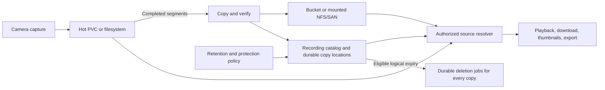

# PRD — Hot Storage & External Recording Archive

**Status**: NVR implementation delivered in this workspace; provider qualification
and the separate cloud control-plane rollout remain outstanding. See the
[operator guide](../STORAGE_ARCHIVE.md) for supported behavior and limits, and the
[implementation record](../internal/STORAGE_02_IMPLEMENTATION.md) for validation.
**Created**: 2026-09-13
**Owner**: TBD
**Scope**: A bounded hot recording volume, a dedicated external archive, unified
retention and protection, and playback across storage tiers.

## 1. Product outcome

Cloud LightNVR instances record to a persistent volume used for capture and
recent footage, then move completed recordings to a connected bucket according
to policy. Operators search, play, download, protect, and delete recordings from
the same library regardless of where their bytes reside. The same lifecycle
works with administrator-mounted NFS or SAN-backed filesystems.

For example: keep ordinary footage hot for 48 hours and retain it for 30 days
total; retain detection footage for 90 days; archive protected incidents and
keep them indefinitely until protection is explicitly released. Moving footage
does not restart retention or create a second entry in the recording library.

The cost hypothesis is that a smaller hot volume plus external archive can cost
less than keeping the entire retention window on provisioned block storage.
Success must account for transfer, retrieval, requests, and temporary copies as
well as stored bytes. This draft makes no provider price or savings guarantee.

## 2. Existing foundation and gaps

This is the concrete external integration anticipated by
[Storage 01](STORAGE_01_Multi_Target_Lifecycle.md), whose filesystem work is
already implemented. This document defines the archive requirements and the
deployment integration contract independently of any separate cloud service.

Repository review at `9915688a` identified these boundaries:

| Existing foundation | Required extension |
| --- | --- |
| Targets, pools, target UUID/object keys, and mount guards | Object targets with bucket configuration, credentials, and explicit capabilities; the current schema permits only `filesystem` |
| Durable move/copy jobs, SHA-256 verification, retry, bandwidth limits, and archival windows | Object transfers and durable cleanup that survive network and process failure |
| Age migration and retained copies | Separate archive eligibility from deletion eligibility; the lifecycle scheduler currently filters out `protected` recordings |
| Per-stream retention, overrides, protection, and pressure policies | One logical retention decision across every copy, with hot-copy eviction as a separate operation |
| Playback, download, thumbnails, and filesystem cleanup | A shared source resolver; these consumers still contain local `file_path`, `stat`, and `unlink` assumptions |
| Retained-copy metadata and best-effort file cleanup | Persistent per-copy deletion outcomes before metadata can be discarded |

Primary implementation references are
[target schema](../../db/migrations/0065_add_storage_targets.sql),
[copy/job schema](../../db/migrations/0071_complete_storage_migration_controls.sql),
[lifecycle scheduler](../../src/database/db_storage_lifecycle.c),
[mover](../../src/storage/storage_migration.c),
[playback](../../src/web/api_handlers_recordings_playback.c), and
[storage maintenance](../../src/storage/storage_manager.c).

## 3. Goals and initial scope

- Size hot storage around recent access, capture headroom, and archive outages.
- Support age, recording class, protection, pressure, and scheduled transfer rules.
- Preserve protected footage indefinitely in external storage without requiring
  a permanent local media copy.
- Apply retention, authorized deletion, and copy-count requirements everywhere.
- Keep capture responsive during slow transfers, retrieval, and target outages.
- Make location, availability, backlog, retention, and costs understandable.

The first object-storage adapter targets S3-compatible APIs. Qualify each provider
against the required capabilities before enabling hot-copy eviction. Existing
mounted filesystem targets provide NFS/SAN support. A SAN volume must be mounted
and managed by the operator; this feature does not provision block devices or
implement a network filesystem.

Initial delivery includes one hot pool and one archive destination per effective
policy. It supports ordinary online object storage: “cold” describes LightNVR's
role for the target, not a provider class with delayed retrieval. Existing
required-copy policies remain enforced; new multi-stage archive chains, native
Azure/GCS adapters, delayed provider restore classes, and provider Object Lock
configuration are later work. Direct capture to a bucket is outside this scope.

Storage 01's lightweight core constraint remains: provider SDKs and cloud
credential handling belong behind an optional adapter boundary. Packaging as a
helper or sidecar is an implementation decision to validate in P0.

## 4. Product model and invariants

| Concept | Meaning |
| --- | --- |
| Logical recording | Stable recording identity, camera, capture interval, events, tags, protection, and retention intent |
| Durable copy | Verified media on a target, with immutable object identity, size, checksum, and provider version when applicable |
| Hot residency | How long or under what pressure a local durable copy should remain |
| Archive | A durable copy on the configured external target |
| Retrieval cache | Evictable bytes fetched for playback, thumbnails, or exports; never counted toward required durable copies |
| Retention | When the logical recording becomes eligible for deletion across all tiers |
| Protection | Prevents automatic logical deletion; permits verified relocation |
| Local pin | A separate requirement to retain a hot copy; protection alone does not imply a local pin |

These invariants apply to every cleanup path, including emergency cleanup:

1. Only finalized recordings can be archived. In-progress capture stays hot.
2. Publish and verify a destination, commit its durable identity, then evict the
   source only if placement and required-copy requirements remain satisfied.
3. A protected recording may move to the archive, but automatic work cannot
   remove its last required durable copy. Future
   [OPS 02 holds](OPS_02_Evidence_Cases_Integrity.md) obey the same principle,
   including any explicit location or copy requirements.
4. Capture timestamps are authoritative. Upload, migration, restore, playback,
   and protection release do not reset age.
5. One recording appears once in search, counts, and the timeline. Copies remain
   visible in storage details and physical-byte accounting.
6. An unavailable target or missing local file does not prove a recording is
   absent. Errors cannot trigger deletion of its catalog entry.
7. “Protected indefinitely” means no LightNVR automatic expiry. External bucket
   deletion, lost credentials, or account termination can still make footage
   unavailable and must never be presented as successful preservation.

## 5. Policy requirements

### 5.1 Rules and examples

Extend Storage 01's selectors and versioned policy model. The effective policy
must distinguish archive timing, hot residency, total retention, required copies,
and behavior when storage is unavailable. Archive timing must support hours or
seconds; the current whole-day migration field cannot express every use case.

| Example policy | Archive and hot residency | Total retention |
| --- | --- | --- |
| Ordinary continuous | Archive at 48 hours; remove hot copy after verification | 30 days from capture |
| Detection footage | Archive at 24 hours; retain hot copy for 7 days | 90 days from capture |
| Protected incident | Prioritize archival after finalization or protection; retain hot copy for 24 hours if capacity allows | Indefinite while protected |
| Pressure-driven | Archive eligible completed footage early above high watermark; evict verified hot copies to low watermark | Preserve existing logical retention |
| Overnight NAS | Transfer completed segments during a configured window | Existing stream retention, including protection |

Examples are editable presets, not automatic changes to existing installations.
Already-expired, unprotected recordings should enter deletion rather than incur
an unnecessary upload. Protected recordings remain eligible for archival after
ordinary retention would otherwise have expired.

### 5.2 Precedence and policy edits

Retain Storage 01 precedence: hold/protection constraints, per-recording override,
event policy, camera policy, selector policy, then system default. The effective
policy view explains the winning rules and next actions separately for placement
and deletion. A finite override cannot cause automatic deletion while protected.

For compatibility, existing retention ages retain their `start_time` basis;
archival also uses capture age and additionally requires finalization. Record
the applied policy identity and version explicitly rather than extracting durable
identity from a human-readable placement reason. Freeze the effective version
for new recordings. Applying a changed policy to existing recordings is a
separate, previewable operation showing uploads, bytes, new expiry dates, and
recordings that would become immediately eligible for deletion.

Use explicit API modes for `inherit`, `finite`, and `indefinite` retention, mapped
to legacy values at the compatibility boundary. Distinguish “archive immediately
after completion” from “archive disabled”; a zero duration cannot mean both.

Unprotecting footage returns it to its applicable capture-based retention. If
that makes it immediately eligible for deletion, show this consequence before
the user commits the release. Protection changes must reach all lifecycle jobs,
not merely alter the recording-list badge.

### 5.3 Pressure, quotas, and outages

Hot pressure first reclaims unused retrieval/transcode caches and redundant,
verified hot copies allowed by policy. It then prioritizes eligible archive
transfers. Reclaim only bytes on the pressured filesystem; deleting an archive
object does not free PVC space. Copies on one physical failure domain cannot
satisfy a policy requiring independent copies.

If the archive is unavailable, retain the only copy and retry. When hot capacity
approaches exhaustion, expose backlog, estimated runway, and the selected
fallback: another healthy target, pause affected capture, or explicitly allow
existing early-deletion rules for eligible unprotected footage. The proposed
cloud default pauses affected capture at the reserve boundary if no safe
reclamation or fallback remains. This policy can sacrifice new footage to
preserve existing footage; the UI must state that tradeoff and emit gap events.

Protection, holds, minimum retention, and required copies are never silently
overridden by a budget or pressure threshold. Existing installations retain
their configured compatibility behavior until a tiered policy is enabled.

Separate hot capacity, archive physical bytes, and logical per-stream quotas.
Define whether each quota limits physical occupancy or authorizes logical
deletion. Preserve the legacy `max_storage_mb` interpretation for compatibility;
new tiered policies must show an explicit quota scope. Count a recording once
toward a logical quota and every durable copy toward physical usage. Protected
bytes count toward usage but remain ineligible for automatic deletion. Unknown
bucket capacity is shown as unknown, with configured budget limits separately.

Transfer windows include a timezone. Early transfer under pressure may bypass a
window only when the policy explicitly permits it. Bound concurrency, bandwidth,
retries, and queue scans; give capture resources priority over background work.

## 6. Archive connection and transfer

### 6.1 Connection

A cloud instance connects a private dedicated bucket, or a strictly isolated
managed namespace where later supported. The initial managed offering provisions
one bucket per instance; multiple tenants must never share recording credentials.
Configuration records endpoint, region, bucket, managed prefix, credential
reference, encryption requirements, ownership, and capabilities.

The control plane owns provisioning and secret distribution. LightNVR owns the
recording catalog and lifecycle decisions. Core target APIs store credential
references and redacted status; they never return credentials to the browser or
include them in job errors, exports, or logs. Runtime credentials have access to
the owned namespace without account-wide administration or bucket deletion.

Qualification covers upload, independent verification, metadata lookup, byte-range
read, deletion, multipart recovery, credential rotation, and unavailable-target
behavior. Probe using a dedicated test object, then clean it up and report a
failed cleanup. Validate configured endpoints and redirects against deployment
network policy; object keys must not permit path traversal or namespace escape.

Capabilities are explicit and tested per adapter/provider. Qualification must
verify the required operations rather than infer support from an S3-compatible
label. Protection and retention remain catalog decisions; they must not depend
on provider-specific tag or lifecycle features.

### 6.2 Durable migration

Extend the current job journal and copy metadata; do not add a parallel recording
database. A transfer records source/destination identities, immutable destination
key, policy version, progress, attempts, and multipart state when used.

1. Claim a finalized source and record transfer intent before remote writes.
2. Upload to a unique object identity. Incomplete data is not a readable copy.
3. Verify expected length and content integrity independently. Persist the
   verification result and immutable provider version where available.
4. Atomically register the verified copy and update the preferred source.
5. Recheck placement, protection/hold constraints, copy count, and active reads;
   remove the source only when permitted. Failed removal stays `cleanup_pending`.

A process restart at any step must resume or reconcile that operation without
overwriting another recording or losing its only verified copy. Cancellation
leaves a valid source; committed destinations and unfinished uploads remain
tracked until their cleanup or adoption completes. Retries must resolve an
ambiguous upload success before creating additional billable versions.

Retain SHA-256 as recording integrity metadata. Accept provider verification only
when its checksum semantics are qualified for the exact upload mode; otherwise
read back and hash the object before hot eviction. An ETag or client-written
checksum field alone is insufficient proof of content. S3's multipart and
single-part checksum semantics differ. [S3 upload integrity](https://docs.aws.amazon.com/AmazonS3/latest/userguide/checking-object-integrity-upload.html)

Migration keeps detections, tags, bookmarks, protection, and capture identity
attached to the same logical recording. Thumbnail and transcode derivatives are
regenerable cache assets unless a separate policy explicitly archives them.

## 7. Retention and deletion across all tiers

One evaluator decides logical expiry using current protection/holds and the
applied retention policy. Archive transfer and hot-copy eviction must never call
a helper that deletes the logical recording as a side effect.

Required copy counts govern a recording while it must be retained. Once an
unprotected recording is eligible for logical deletion, that operation removes
all managed copies; replication must not recreate them or prevent expiry.

Logical deletion is a durable operation:

- Serialize deletion against protection, holds, migration commit, and source
  selection. Recheck current eligibility when claiming deletion. Atomically
  establish `deletion_pending`; later protection requests fail clearly once
  deletion is committed, and cannot claim footage has been preserved.
- Preserve a tombstone and every known object/version identity while deleting
  originals, replicas, archive copies, and derived caches. An in-flight upload
  cannot publish after deletion; its output is added to the cleanup inventory.
- Track each copy as pending, removed, retrying, or blocked. Retain enough metadata
  to retry even if the operator has removed the recording from ordinary views.
- Complete deletion only after all managed copies are confirmed absent. Missing
  objects are idempotent success only after an authoritative object-level result;
  timeouts, permission failures, and an unavailable bucket are not absence.
- Expose partial deletion and provider retention blocks as persistent conditions.
  Single, batch, scheduled, quota, and emergency paths use the same service.

An authorized manual deletion follows existing access controls and must explain
protected-footage handling. The proposed tiered flow requires explicit protection
release before deletion; bulk operations exclude protected recordings by default.
Audit the initiator, reason, policy version, and completion outcome.

Provider lifecycle expiry must not independently delete managed recordings.
Provisioned buckets omit blanket media-expiration rules; connected buckets must
be checked for conflicting rules. If rules cannot be inspected, full retention
enforcement remains unverified and automatic hot eviction stays disabled until
configuration is verified. Allowed multipart cleanup applies only to abandoned
uploads beyond the supported resume horizon. Recheck for external configuration
drift and stop new eviction when the preservation contract becomes uncertain.

Versioned targets need version-aware deletion and byte accounting. In S3, a
delete without a version ID can create a delete marker while retaining object
bytes. Delete managed versions explicitly; do not report storage reclaimed merely
because ordinary reads return missing. Adapter qualification may reject versioned
buckets until this is supported. [S3 DeleteObject behavior](https://docs.aws.amazon.com/AmazonS3/latest/API/API_DeleteObject.html)

Application protection does not configure provider Object Lock. Existing provider
locks may delay requested deletion and must be reported without claiming success.

## 8. Finding and loading recordings

### 8.1 One library

Recordings, timeline, investigation views, and search continue to query the local
catalog across all tiers. Do not list the bucket during interactive search. Keep
camera identity, capture time, detections, tags, protection, codec facts, and
availability metadata available while the archive is offline.

Display useful states: **Hot**, **Hot + archive**, **Archived**, **Archiving**,
**Preparing playback**, **Unavailable**, and **Deletion pending**. Storage details
explain hot eviction timing, retention expiry or indefinite protection, copy
health, and the next retry. An archive outage remains visibly different from a
gap where no recording was captured.

### 8.2 Shared source resolver

Playback, seek, single/batch download, thumbnail generation, transcode, and evidence
export use one authorized resolver keyed by logical recording identity. Prefer
a healthy local copy, then a verified external copy. Preserve recording URLs and
existing access checks; a local path is a compatibility detail, not durable identity.

For the initial release, use authenticated byte-range proxy reads for compatible
media and bounded asynchronous local staging when a consumer needs a filesystem
path. Preserve range/status/content-length behavior so MP4 seeking works without
downloading every preceding byte. Handle client cancellation and upstream timeout
without blocking the capture or HTTP worker pools.

Return a job/status response when staging is necessary, with a visible preparing
state, retry, and cancellation. Deduplicate concurrent preparation of the same
source. Cache keys include recording and source version; source changes invalidate
stale derivatives. Reserve cache bytes before fetching and limit total bytes,
concurrency, and idle lifetime. Active readers pin their cache/source until a
bounded read lease ends. New reads stop once logical deletion commits.

Playback does not restart retention, create a new durable recording, or permanently
promote an archive copy to hot storage. If cache space cannot be reserved, explain
the failure and permit direct streaming where supported. Browsing thumbnails must
not silently download the entire archive; generate on demand with bounded work.

Presigned direct reads are a later optimization, gated on short expiry, exact
object scope, authorization before issue, CORS/range behavior, revocation limits,
and deployment ingress paths. Provider delayed-retrieval classes likewise require
a future restore state and cost/latency UX before becoming eligible destinations.

## 9. Recovery, cloud operations, and visibility

The recording catalog and job journal must survive pod replacement. Back them up
with target identities, policy versions, protection, and archive locations using
[OPS 01](OPS_01_Backup_Restore.md). A bucket full of media alone does not recover
recording intent or protection history. Before managed-cloud launch, demonstrate
catalog restore on a replacement instance and reconciliation with an archive
that has changed since the backup. Keep destructive cleanup disabled until that
reconciliation is complete. Lost catalog state requires preservation by default.

Maintenance, rescan, orphan cleanup, missing-file repair, and size synchronization
must understand external copies. A deliberately evicted local file cannot prune
an archived recording. Use bounded reconciliation to identify missing objects,
unknown objects, interrupted uploads, and stale versions. Quarantine unexplained
objects for operator review rather than automatically deleting them.

Target disablement pauses new jobs without discarding references. Detaching or
deleting a referenced target requires relocation or an explicit destructive
workflow. Pod restart, compute suspension, and ordinary instance teardown must
not implicitly delete its archive. Offer export/transfer or a separately
confirmed archive deletion flow, with protected-byte impact shown. Customer-owned
buckets are never deleted as infrastructure cleanup.

If retention must continue while compute is suspended, the cloud control plane
must keep a maintenance worker running with the authoritative catalog and enforce
one lifecycle owner at a time. Otherwise show retention maintenance as paused;
do not substitute a blanket bucket TTL. Cloud grace periods, archive-only billing,
and account closure terms must be settled before commercial rollout.

The Storage UI and API expose hot/archived/protected/cache bytes, pending upload
and deletion bytes, oldest backlog age, verification failures, read failures,
archive throughput, and estimated hot runway. Keep logical bytes separate from
physical copies and provider usage observations. Extend existing compliance
conditions and Fleet 03 events for persistent failures and recovery.

Meter provisioned PVC capacity, archive byte-time, requests where billed,
upload/verification/retrieval traffic, and playback egress separately. Record
temporary duplicate storage and incomplete-upload costs. Show estimates with
sample windows and configurable current rates; do not embed historical provider
pricing as a fixed rate.

For planning, estimate:

`hot bytes ≈ ingest bytes/day × hot-residency days + outage backlog + active segments + caches + reserve`

An illustrative 1 TB/day workload with 30-day retention and 2-day hot residency
has roughly 2 TB of steady hot media and 28 TB of archive media, before reserve,
outages, protected accumulation, replication, and caches. Actual PVC cost reduction
requires provisioning smaller capacity or migrating to a smaller volume; file
eviction alone does not change already-provisioned capacity charges.

## 10. Delivery phases

| Phase | Deliverable | Depends on |
| --- | --- | --- |
| P0 — foundation and provider qualification | Shared copy/source contract, protected migration eligibility, durable deletion design, provider capability tests, connection and secret model, measured verification cost | Storage 01 |
| P1 — complete archive workflow | Upload/verify/commit/evict, restart recovery, unified retention/deletion, protected indefinite archive, range playback/download, bounded preparation, cache and orphan-cleanup integration | P0 |
| P2 — policies and operations | Rule editor and simulation, protected/age/pressure/window policies, visible location and errors, compliance, quotas, telemetry, mounted NFS/SAN qualification | P1 |
| P3 — managed cloud release | Dedicated bucket provisioning, secret rotation, metering, suspension/teardown behavior, restore exercise, sustained provider pilot, smaller hot-volume rollout | P2; cloud provisioning; OPS 01 recovery capability |
| Later | More providers, multiple archive stages, direct signed reads, delayed restore classes, provider immutability integration | Concrete deployments and capability qualification |

Use copy-only mode for an initial pilot, then enable hot eviction for selected
policies after retrieval and retention validation. Existing deployments upgrade
with unchanged media placement and retention. Disabling archival stops new
transfers while retaining external reads and cleanup. Downgrading to a binary
without external-copy support requires draining media to compatible targets and
validating the catalog first.

## 11. Acceptance and release gates

| Scenario | Required result |
| --- | --- |
| Ordinary recording crosses hot age | One library entry; verified archive copy; hot bytes reclaimed; expiry unchanged |
| Protected recording is older than all ordinary retention limits | Archives successfully; stays searchable and playable; no automatic path removes its required copies |
| Protection released after expiry | UI explains immediate eligibility; subsequent unified cleanup removes all managed copies |
| Process killed during upload, verification, commit, or source removal | Recoverable journal; no lost sole copy, duplicate catalog entry, or untracked object |
| Protect/delete/migrate race | A committed protection prevents automatic deletion; committed deletion rejects late protection; late uploads cannot resurrect deleted footage |
| Archive outage plus hot pressure | Capture continues within headroom; affected fallback then applies; protected/minimum-retention data survives; other targets are unaffected |
| Playback during migration or eviction | Authorized read uses a verified source or pinned cache; seeks work; expiry is unchanged |
| Archived HEVC, thumbnail, or batch export | Bounded preparation and useful progress/error states; cache cannot consume capture reserve |
| Remote deletion times out or is forbidden | Tombstone and per-copy retries survive restart; UI reports pending/blocked deletion and unreclaimed bytes |
| Local rescan after successful eviction | Archived metadata, events, tags, and protection remain intact |
| Versioning or provider expiry conflicts | Unsafe capability/configuration blocks enablement or eviction; no false deletion/preservation success |
| Credential rotation and cross-tenant access attempts | Authorized work recovers with new credentials; users cannot access another instance's objects or secrets |
| Pod replacement, catalog restore, compute suspension, target detach | Durable identity and protection survive; cleanup cannot infer absence from lost local state |
| Mounted NFS/SAN outage and recovery | Same lifecycle semantics, mount-loss guards, bounded work, and successful playback after recovery |
| Upgrade and disable | Existing local recordings remain playable; disabling new transfers preserves archive access |

For release, run a 72-hour provider pilot at the advertised stream/bitrate tier,
including sustained capture, mixed local/archive reads, a one-hour archive outage,
worker restarts, and backlog recovery. With resources sized for the tier and the
target healthy, transfer service capacity must exceed eligible ingress and the
queue must remain bounded. Archive work must cause no additional recording gaps
versus a control run; capture fallback gaps during the deliberate outage must be
reported explicitly. Verify steady hot occupancy against the configured residency,
headroom, and cache budgets, and report observed retrieval latency, CPU/memory,
request counts, and total storage/transfer cost before setting customer SLOs.

## 12. Remaining product decisions

- Confirm Spaces as the first managed provider and whether customer-owned buckets
  ship with the initial managed offering or follow it.
- Select hot-residency presets, outage reserve targets, archive byte budgets, and
  whether users may opt into early deletion of eligible unprotected footage.
- Set archive-only service, suspension maintenance, billing grace periods, and
  account-closure behavior consistent with the preservation contract.
- Define catalog backup frequency and acceptable recovery point before claiming
  protected footage survives loss of the instance volume.

These choices are open in this draft. They do not weaken the verified-copy,
protection, unified-retention, and durable-deletion requirements.
