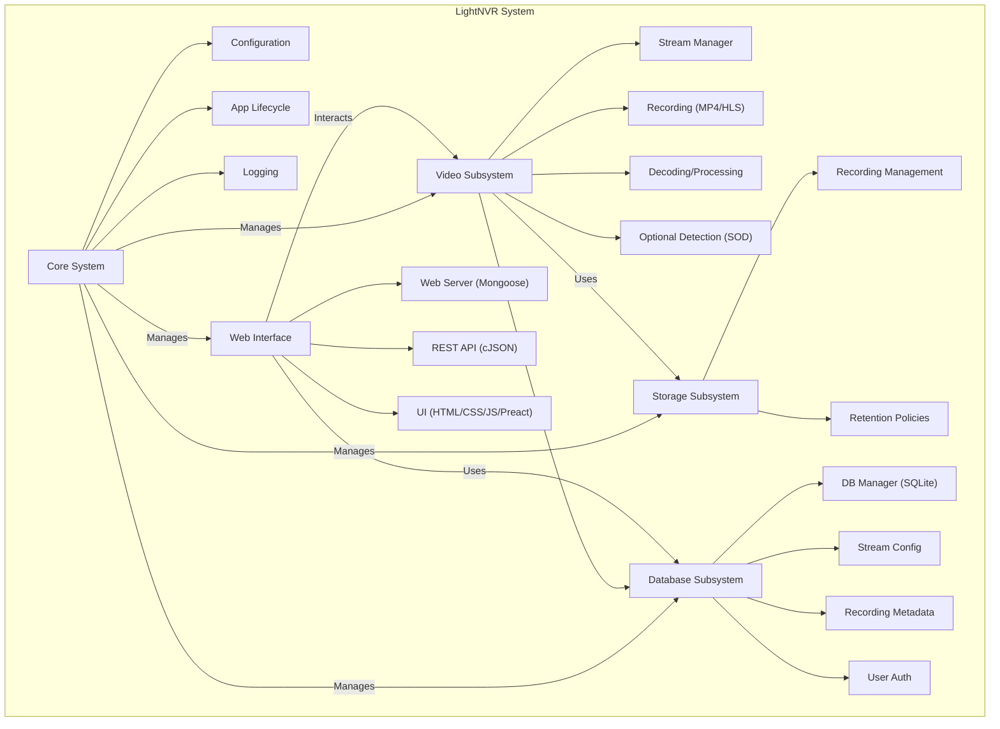

# System Patterns: LightNVR

## Architecture Overview

LightNVR employs a modular, multi-threaded architecture in C, optimized for low-memory Linux environments. Key subsystems include Core, Video, Storage, Database, and Web Interface.

## Key Technical Decisions & Patterns

- **Language:** C for maximum control over memory and performance.
- **Memory Optimization:**
    - **Efficient Buffering:** Configurable stream buffers, intelligent frame dropping under pressure.
    - **Memory Pools:** Pre-allocation for common objects to reduce fragmentation.
    - **Staggered Initialization:** Sequential stream startup to avoid memory spikes.
    - **Resource Governors:** Prevent crashes due to memory exhaustion.
    - **Optional Swap:** Support for swap files as virtual memory.
- **Threading Model:** Multi-threaded design:
    - Main Thread (Lifecycle, Signals)
    - Per-Stream Threads (Video I/O, Processing)
    - Recording Threads (Disk I/O)
    - Web Server Thread (HTTP Requests)
    - API Thread Pool
    - Synchronization via mutexes and condition variables.
- **Persistence:** SQLite for storing configuration, metadata, and user data due to its lightweight nature and single-file deployment.
- **Web Server:** Mongoose embedded web server for serving the UI and API.
- **API:** RESTful API using standard HTTP methods and JSON (parsed with cJSON).
- **Configuration:** Simple key-value file (`lightnvr.conf`) supplemented by database storage for dynamic settings.
- **Shutdown Coordination:** Priority-based, coordinated shutdown sequence managed by `Shutdown Coordinator` to ensure graceful termination and prevent data corruption. Components register and follow signals.
- **Modularity:** Code is organized into subsystems (core, video, storage, database, web) with clear responsibilities defined in `src/` and `include/`.

## Component Relationships & Data Flow

- **Stream Processing:** Camera -> Stream Thread (Decode/Process/Buffer) -> Recording Thread (Write to Disk) / Web Server (Live View).
- **Web Interaction:** User Browser <-> Web Server <-> API Handlers <-> Database/Video Subsystem.
- **Configuration:** File (`lightnvr.conf`) -> Core System -> Database -> Applied by Subsystems.

## Diagrams

*(Refer to `docs/images/` for detailed SVG diagrams of Overall, Thread, and State Management architectures)*
